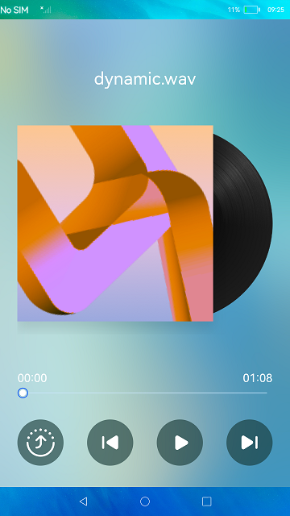

# Distributed Music Player

### Introduction

In this sample, **fileIo** is used to obtain an audio file; **AudioPlayer** is used to play music, pause the playback, and play the next or previous song; **DeviceManager** is used to display the distributed device list and hop music playback across devices. The display effect is as follows:

### Concepts

Audio playback: The media subsystem provides audio and video services and implements audio playback by using **AudioPlayer**.

Data hop: The distributed data management module implements collaboration between databases of different devices for applications. The APIs provided by distributed data management can be used to save data to the distributed database and perform operations such as adding, deleting, modifying, and querying data in the distributed database.

### Required Permissions

ohos.permission.DISTRIBUTED_DATASYNC

### Usage

1. Play music. Touch the buttons on the music player to play music, pause the playback, and play the next or previous music clip.

2. Play music across devices. On the Super Device formed by multiple networked devices, touch the **Hop** button and select a device to play the music on the peer device.

### Constraints

- This sample can only be run on standard-system devices.

- This sample requires DevEco Studio 3.0 Beta4 (Build Version: 3.0.0.992, built on July 14, 2022) to compile and run.

- If the app is set as a preset app, "error: install sign info inconsistent" will be displayed during the app installation. If this occurs, run the following commands to install the app and restart the device after the installation:

  **hdc shell mount -o rw,remount /**

  **hdc file send ./entry-default-signed.hap /system/app/com.ohos.distributedmusicplayer/Music_Demo.hap**

  **hdc shell  reboot**

After the device is restarted, the app is installed. No other operation is required.
