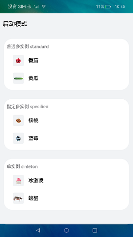
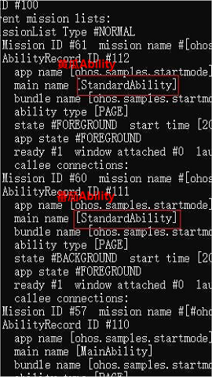
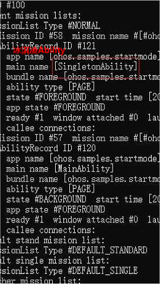
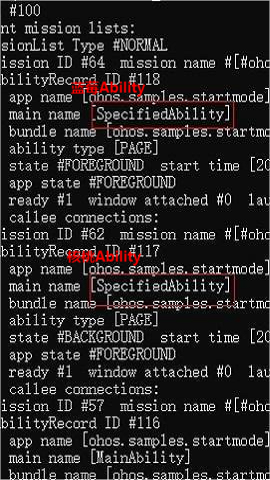

# Ability的启动模式

### 介绍

本示例展示了在一个Stage模型中，实现standard、singleton、specified多种模式场景。

本实例参考[开发指南](https://gitee.com/openharmony/docs/blob/master/zh-cn/application-dev/quick-start/stage-structure.md) 。
本实例需要使用[aa工具](https://gitee.com/openharmony/docs/blob/master/zh-cn/application-dev/tools/aa-tool.md) 查看应用Ability 模式信息。 

1、standard模式：

1）进入首页，点击番茄，会新建一个番茄的Ability，展示番茄的详情；

2）在番茄的详情界面，点击黄瓜，会新建一个黄瓜的Ability，展示黄瓜的详情；

3）使用aa工具查看Ability信息，此时存在以下Ability：1个番茄的Ability、1个黄瓜的Ability、1个首页的Ability；

2、singleton模式：

1）进入首页，点击冰淇凌，会新建一个冰淇凌的Ability，展示冰淇凌的详情；

2）在冰淇凌的详情界面，点击螃蟹，会复用冰淇凌的Ability，页面数据会刷新并展示螃蟹的详情；

3）使用aa工具查看Ability信息，此时存在以下Ability：1个冰淇凌的Ability、1个首页Ability；

3、specified模式：

1）进入首页，点击核桃，会新建一个核桃的Ability，展示核桃的详情；

2）在核桃的详情界面，点击蓝莓，会新建一个蓝莓的Ability，展示蓝莓的详情；

3）在蓝莓的详情界面，点击核桃，会复用已存在的核桃的Ability，实现specified模式下的单实例特性，页面数据会刷新并展示核桃的详情；

4）使用aa工具查看Ability信息，此时存在以下Ability：1个核桃的Ability、1个蓝莓的Ability、1个首页Ability；

### 效果预览

  

### 相关权限

不涉及。

### 依赖

不涉及。

### 约束与限制

1.本示例仅支持标准系统上运行,支持设备:RK3568。

2.本示例仅支持API version 9版本SDK，版本号：3.2.10.6。

3.本示例需要使用DevEco Studio 3.1 Canary1 (Build Version: 3.1.0.100)及以上才可编译运行。