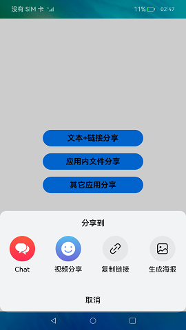

# 自定义分享

### 介绍

自定义分享主要是发送方将文本，链接，图片三种类型分享给三方应用,同时能够在三方应用中展示。本示例使用[数据请求](https://gitee.com/openharmony/docs/blob/master/zh-cn/application-dev/reference/apis/js-apis-http.md)
实现网络资源的获取，使用[屏幕截屏](https://gitee.com/openharmony/docs/blob/master/zh-cn/application-dev/reference/apis/js-apis-screenshot.md)
实现屏幕的截取，使用[文件管理](https://gitee.com/openharmony/docs/blob/master/zh-cn/application-dev/reference/apis/js-apis-fileio.md)
实现对文件，文件目录的管理，使用[媒体库管理](https://gitee.com/openharmony/docs/blob/master/zh-cn/application-dev/reference/apis/js-apis-medialibrary.md)
获取截取的图片，使用[弹窗](https://gitee.com/openharmony/docs/blob/master/zh-cn/application-dev/reference/apis/js-apis-prompt.md)
进行信息的提示。

使用说明：

1.启动Share应用，首页展示分享跳转页面，点击分享按钮出现自定义分享弹窗（三方APP的）。

2.点击分享文本+链接，选择"Chat"图标，会拉起三方应用[Chat](https://gitee.com/openharmony/applications_app_samples/blob/master/AppSample/Chat)
，此时选择[聊天列表](https://gitee.com/openharmony/applications_app_samples/blob/master/AppSample/Chat/entry/src/main/ets/MainAbility/pages/Index.ets)
中任意的朋友进行分享。

3.点击生成海报，此时第一层弹窗消失并出现新的弹窗，点击截图并分享，会出现小提示"截图成功，分享加载中..."
,稍后会拉起三方应用[Chat](https://gitee.com/openharmony/applications_app_samples/blob/master/AppSample/Chat)
，此时选择[聊天列表](https://gitee.com/openharmony/applications_app_samples/blob/master/AppSample/Chat/entry/src/main/ets/MainAbility/pages/Index.ets)
中任意的朋友进行分享。

### 效果预览

   

### 相关权限

允许应用截取屏幕图像：[ohos.permission.CAPTURE_SCREEN](https://gitee.com/openharmony/docs/blob/master/zh-cn/application-dev/security/permission-list.md)

允许使用Internet网络：[ohos.permission.INTERNET](https://gitee.com/openharmony/docs/blob/master/zh-cn/application-dev/security/permission-list.md)

允许应用访问用户媒体文件中的地理位置信息：[ohos.permission.MEDIA_LOCATION](https://gitee.com/openharmony/docs/blob/master/zh-cn/application-dev/security/permission-list.md)

允许应用读取用户外部存储中的媒体文件信息：[ohos.permission.READ_MEDIA](https://gitee.com/openharmony/docs/blob/master/zh-cn/application-dev/security/permission-list.md)

允许应用读写用户外部存储中的媒体文件信息：[ohos.permission.WRITE_MEDIA](https://gitee.com/openharmony/docs/blob/master/zh-cn/application-dev/security/permission-list.md)

### 依赖

依赖于[Chat](https://gitee.com/openharmony/applications_app_samples/blob/master/AppSample/Chat)  应用，来作为接收方。

### 约束与限制

1.本示例仅支持标准系统上运行,支持设备:RK3568。

2.本示例为Stage模型，仅支持API9版本SDK，版本号：3.2.10.6。

3.本示例需要使用DevEco Studio 3.1 Canary1 (Build Version: 3.1.0.100)及以上才可编译运行。

4.本示例使用的screenshot API属于SystemAPI，需要使用Full SDK 手动从镜像站点获取，并在DevEco
Studio中替换，具体操作可参考[替换指南](https://docs.openharmony.cn/pages/v3.2/zh-cn/application-dev/quick-start/full-sdk-switch-guide.md/)
。

5.本示例涉及相关权限为system_core级别（相关权限级别可通过[权限定义列表](https://gitee.com/openharmony/docs/blob/master/zh-cn/application-dev/security/permission-list.md)
查看）， 需要手动配置高级别的权限签名(
具体操作可查看[自动化签名方案](https://docs.openharmony.cn/pages/v3.2/zh-cn/application-dev/security/hapsigntool-overview.md/))。
