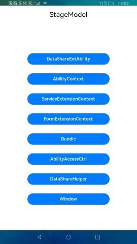

# Stage Model

### Introduction

The [stage model](https://gitee.com/openharmony/docs/blob/master/en/application-dev/ability/stage-brief.md) is designed to make it easier to develop complex applications in the distributed environment.

The stage model is designed based on the following considerations:

- **Balance between application capabilities and overall system power consumption**

  On a running device, resources are weighted towards foreground applications, on the prerequisites that the overall power consumption requirements of the system are met. The stage model balances the application capabilities and overall system power consumption through ability and UI separation, strict background control, scenario-based service mechanism, and single-process model.

- **Native support for component continuation and collaboration**

  OpenHarmony natively supports distributed deployment. Therefore, its application framework must be designed for easier component migration and collaboration. The stage model achieves this design objective by providing features such as separation between ability and UI as well as integration of UI display and service capabilities.

- **Support for multiple device types and window forms**

  To support multiple device types and facilitate the implementation of different window forms, the component manager and window manager must be decoupled at the architecture layer for easier tailoring. To achieve this goal, the stage model redefines the ability lifecycle and implements unidirectional dependency for the component manager and window manager.

  This sample shows the differences between the stage model and the FA model in terms of the **AbilityContext**, **ServiceExtensionContext**, **FormExtensionContext**, **DataShareExtensionAbility**, **FormExtension**, **Bundle**, **Window**, and **AbilityAccessCtrl** modules.

  **ServiceExtensionAbility**: This module provides lifecycle functions **onCreate**, **onRequest**, **onConnect**, **onReconnect**, **onDisconnect**, and **onDestroy**. In **AbilityContext**, **startAbility** is used to start a Service ability; **connectAbility** is used to connect to a Service ability; **disconnectAbility** is used to disconnect from a Service ability; the remote procedure call (RPC) is used for communication between the client and server.

  **FormExtension**: This module provides the lifecycle functions **onCreate**, **onCastToNormal**, **onUpdate**, **onVisibilityChange**, **onEvent**, **onAcquireFormState**, and **onDestroy**. A widget is created by calling **createFormBindingData** of **formBindingData**.

  **AbilityContext**: This module inherits from **Context** and implements the context for abilities. This module provides APIs for accessing ability-specific resources. You can use the APIs to start and terminate an ability, obtain the caller interface, and request permissions from users by displaying a dialog box. Before using the **AbilityContext** module, you must define a child class that inherits from **Ability**.

  **ServiceExtensionContext**: This module inherits from **ExtensionContext** and provides context for Service Extension abilities. You can use the APIs of this module to start, terminate, connect, and disconnect abilities. Before using the **ServiceExtensionContext** module, you must define a child class that inherits from **ServiceExtensionAbility**.
  
  **FormExtensionContext**: This module inherits from **ExtensionContext** and provides context for Form Extension abilities. It provides the interfaces and capabilities for Form Extension abilities. Before using the **FormExtensionContext** module, you must first obtain a **FormExtension** instance.
  
  **DataShareExtensionAbility**: Based on the **ExtensionAbility** framework, this module provides Extension abilities for data share services. The APIs of this module can be used only in the stage model.
  
  **Bundle**: This module provides APIs for querying the information about bundles, applications, abilities, Extension abilities, and application states.
  
  **Window**: This module provides basic window management capabilities, such as creating, destroying, and configuring the current window, and managing and scheduling windows.
  
  **AbilityAccessCtrl**: This module provides APIs for application permission management, including authentication, authorization, and revocation.

#### Differences Between Stage and FA Models

1. The stage model uses **module.json5** as the configuration file, where Service Extension abilities are configured in **extensionAbilities** and Page abilities are configured in **abilities**. The FA model uses **config.json** as the configuration file, where abilities are configured in **module/abilities**.

2. In the stage model, the configuration file required for creating widgets is **resources/base/profile/form_config.json**.

3. The two models have different ability lifecycles. For details, see [Stage Model Lifecycle](https://gitee.com/openharmony/docs/blob/master/en/application-dev/ability/stage-brief.md#lifecycle) and [FA Model Lifecycle](https://gitee.com/openharmony/docs/blob/master/en/application-dev/ability/fa-brief.md#lifecycle).

4. **DataShareExtensionAbility** in the stage model corresponds to **DataAbility** in the FA model. For details about their implementation differences, see the corresponding APIs.

5. **ServiceExtensionAbility** in the stage model corresponds to **ServiceAbility** in the FA model. For details about their implementation differences, see the corresponding APIs.

6. **DataShareHelper** in the stage model corresponds to **DataAbilityHelper** in the FA model. For details about their implementation differences, see the corresponding APIs.

7. Starting from API version 9, the stage model obtains the **resourceManager** object through the context and then calls the internal interfaces to obtain resources without importing **@ohos.resourceManager**. The FA model obtains application resource information by importing **@ohos.resourceManager**.

#### API Mappings Between FA and Stage Models (FA Model -> Stage Model)

**FeatureAbility - > AbilityContext and dataShare interfaces**:

[FeatureAbilityHelper](../FaModel/entry/src/main/ets/MainAbility/feature/FeatureAbilityHelper.ts): getWant -> MainAbility: want

[FeatureAbilityHelper](../FaModel/entry/src/main/ets/MainAbility/feature/FeatureAbilityHelper.ts): startAbilityForResult -> AbilityContextController: startAbilityForResult

[FeatureAbilityHelper](../FaModel/entry/src/main/ets/MainAbility/feature/FeatureAbilityHelper.ts): acquireDataAbilityHelper -> DataShareHelper: createDataShareHelper

[FeatureAbilityHelper](../FaModel/entry/src/main/ets/MainAbility/feature/FeatureAbilityHelper.ts): terminateSelfWithResult -> AbilityContextController: terminateSelfWithResult

[FeatureAbilityHelper](../FaModel/entry/src/main/ets/MainAbility/feature/FeatureAbilityHelper.ts): hasWindowFocus -> Not supported in the stage model

[FeatureAbilityHelper](../FaModel/entry/src/main/ets/MainAbility/feature/FeatureAbilityHelper.ts): terminateSelf -> AbilityContextController: terminateSelf

[FeatureAbilityHelper](../FaModel/entry/src/main/ets/MainAbility/feature/FeatureAbilityHelper.ts): getWindow -> WindowController: getTopWindow

[FeatureAbilityHelper](../FaModel/entry/src/main/ets/MainAbility/feature/FeatureAbilityHelper.ts): startServiceAbility -> AbilityContextController: startAbility

[FeatureAbilityHelper](../FaModel/entry/src/main/ets/MainAbility/feature/FeatureAbilityHelper.ts): connectService -> AbilityContextController: connectAbility

[FeatureAbilityHelper](../FaModel/entry/src/main/ets/MainAbility/feature/FeatureAbilityHelper.ts): disconnectService -> AbilityContextController: disconnectAbility

**context -> AbilityContext, Bundle, Window, and abilityAccessCtrl interfaces:**

[AppContext](../FaModel/entry/src/main/ets/MainAbility/feature/AppContext.ts): getOrCreateLocalDir -> BundleController: entryDir

[AppContext](../FaModel/entry/src/main/ets/MainAbility/feature/AppContext.ts): verifyPermission -> AbilityAccessCtrlController: verifyAccessToken

[AppContext](../FaModel/entry/src/main/ets/MainAbility/feature/AppContext.ts): requestPermissionsFromUser -> AbilityContextController: requestPermissionsFromUser

[AppContext](../FaModel/entry/src/main/ets/MainAbility/feature/AppContext.ts): getApplicationInfo -> BundleController: getApplicationInfo

[AppContext](../FaModel/entry/src/main/ets/MainAbility/feature/AppContext.ts): getBundleName -> AbilityContextPage: abilityInfo.bundleName (attributes)

[AppContext](../FaModel/entry/src/main/ets/MainAbility/feature/AppContext.ts): getDisplayOrientation -> AbilityContextPage: config.direction (attributes)

[AppContext](../FaModel/entry/src/main/ets/MainAbility/feature/AppContext.ts): setDisplayOrientation -> WindowController: setPreferredOrientation

[AppContext](../FaModel/entry/src/main/ets/MainAbility/feature/AppContext.ts): setShowOnLockScreen -> MainAbility: setShowOnLockScreen

[AppContext](../FaModel/entry/src/main/ets/MainAbility/feature/AppContext.ts): setWakeUpScreen -> WindowController: setWakeUpScreen

[AppContext](../FaModel/entry/src/main/ets/MainAbility/feature/AppContext.ts): getProcessInfo -> AbilityContextPage: abilityInfo.descriptionId; abilityInfo.name (attributes)

[AppContext](../FaModel/entry/src/main/ets/MainAbility/feature/AppContext.ts): getElementName -> BundleController: getAbilityInfo

[AppContext](../FaModel/entry/src/main/ets/MainAbility/feature/AppContext.ts): getProcessName -> BundleController: process

[AppContext](../FaModel/entry/src/main/ets/MainAbility/feature/AppContext.ts): getCallingBundle -> want.parameters (attributes)

[AppContext](../FaModel/entry/src/main/ets/MainAbility/feature/AppContext.ts): getCacheDir -> AbilityContextPage: cacheDir (attributes)

[AppContext](../FaModel/entry/src/main/ets/MainAbility/feature/AppContext.ts): getFilesDir -> AbilityContextPage: filesDir (attributes)

[AppContext](../FaModel/entry/src/main/ets/MainAbility/feature/AppContext.ts): getOrCreateDistributedDir -> AbilityContextPage: distributedFilesDir (attributes)

[AppContext](../FaModel/entry/src/main/ets/MainAbility/feature/AppContext.ts): getAppType -> BundleController: entityType

[AppContext](../FaModel/entry/src/main/ets/MainAbility/feature/AppContext.ts): getHapModuleInfo -> AbilityContextPage: currentHapModuleInfo (attributes)

[AppContext](../FaModel/entry/src/main/ets/MainAbility/feature/AppContext.ts): getAppVersionInfo -> BundleController.getDispatcherVersion

[AppContext](../FaModel/entry/src/main/ets/MainAbility/feature/AppContext.ts): getAbilityInfo -> AbilityContextPage: abilityInfo (attributes)

[AppContext](../FaModel/entry/src/main/ets/MainAbility/feature/AppContext.ts): getApplicationContext -> AbilityContextPage: getApplicationContext()

[AppContext](../FaModel/entry/src/main/ets/MainAbility/feature/AppContext.ts): isUpdatingConfigurations -> Not supported in the stage model

[AppContext](../FaModel/entry/src/main/ets/MainAbility/feature/AppContext.ts): printDrawnCompleted -> Not supported in the stage model

 **particleAbility -> ServiceExtensionContext and dataShare interfaces**

 [ParticleAbilityHelper](../FaModel/entry/src/main/ets/MainAbility/feature/ParticleAbilityHelper.ts): startAbility -> ServiceExtContextController: startAbility

 [ParticleAbilityHelper](../FaModel/entry/src/main/ets/MainAbility/feature/ParticleAbilityHelper.ts): connectAbility -> ServiceExtContextController: connectAbility

 [ParticleAbilityHelper](../FaModel/entry/src/main/ets/MainAbility/feature/ParticleAbilityHelper.ts): disconnectAbility -> ServiceExtContextController: disconnectAbility

 [ParticleAbilityHelper](../FaModel/entry/src/main/ets/MainAbility/feature/ParticleAbilityHelper.ts): terminateSelf -> ServiceExtContextController: terminateSelf

 [ParticleAbilityHelper](../FaModel/entry/src/main/ets/MainAbility/feature/ParticleAbilityHelper.ts): acquireDataAbilityHelper -> DataShareHelper: createDataShareHelper

#### Usage

1. Touch **DataShareExtAbility**. The **DataShareExtAbility** page is displayed.

   Touch **+** to add a piece of data to the RDB. The added data is displayed on the page.

   Touch **Delete** to delete the new data.

   Touch the data list. In the dialog box displayed, modify the data and touch **OK**.

   Touch the back button to return to the home page.

2. Touch each function button to test all their functions.

#### Display Effect

### Required Permissions

N/A

### Dependency

The stage model is upgraded from the FA model. For details about the FA model, see [FA Model](../FaModel).

### Constraints

1. This sample can only be run on standard-system devices.

2. **ServiceExtensionAbility** and **DataShareExtensionAbility** are system APIs and require the use of the Full SDK. To use the Full SDK, you must manually obtain it from the mirror and switch to it in DevEco Studio. For details, see [Guide to Switching to Full SDK](https://gitee.com/openharmony/docs/blob/master/en/application-dev/quick-start/full-sdk-switch-guide.md).

3. DevEco Studio 3.1 Canary1 (Build Version: 3.1.0.100) must be used.
