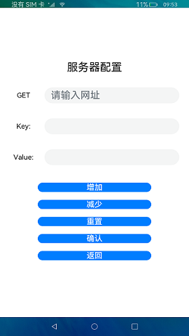
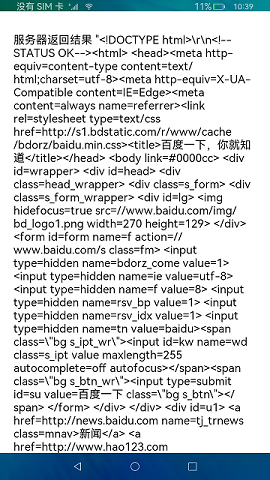

# HTTP

### Introduction

This sample shows how to use the **TextInput** component to enter parameters and use the **Text** component to display the return result.

In this example, we'll use [SystemCapability.Communication.NetStack](https://gitee.com/openharmony/docs/blob/master/en/application-dev/reference/apis/js-apis-http.md) to initiate HTTP network requests to the destination URL based on specified configuration.

Usage

1. When starting the sample application, configure the network request by specifying the destination URL, request mode, and request parameters.

2. Click **OK**. The request result page is displayed.

3. Click **Back** to return to the configuration page.

NOTE: You can compile the http module into a **.tgz** package depending on your need.

### Display Effect

 

### Required Permissions

Access to the Internet: [ohos.permission.INTERNET](https://gitee.com/openharmony/docs/blob/master/en/application-dev/security/permission-list.md)

### Dependency

N/A

### Constraints

1. This sample can only be run on standard-system devices that use the Rockchip RK3568 chip.

2. This sample demonstrates the stage model, which supports only the SDK of API version 9 (SDK version: 3.2.10.6).

3. DevEco Studio 3.1 Canary1 (Build Version: 3.1.0.100) must be used.

4. This sample requires network connection throughout the entire process.
