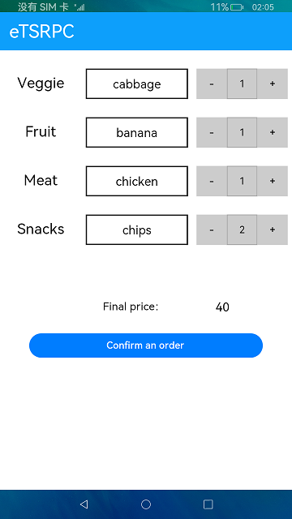

# RPC连接

### 介绍

本示例使用@ohos.rpc相关接口，实现了一个前台选择商品和数目，后台计算总价的功能，使用rpc进行前台和后台的通信。

使用说明：

1. 点击商品种类的空白方框，弹出商品选择列表，选择点击对应的商品，空白方框显示相应内容。

2. 点击商品选择框后的 **+** 或  **-** 按钮，选择商品所对应的数量。

3. 点击 **Confirm an order** 按钮，根据相应的菜品数量与单价，计算出总价并显示。

### 效果预览

|主页|选择列表|
|-----------------|----------------------|
|||

### 相关权限

不涉及。

### 依赖

不涉及。

### 约束与限制

1.本示例仅支持在标准系统上运行。

2.本示例需要使用DevEco Studio 3.1 Canary1 (Build Version: 3.1.0.100, built on November 3, 2022)才可编译运行。

3.本示例仅支持API9版本SDK，版本号：3.2.10.6。