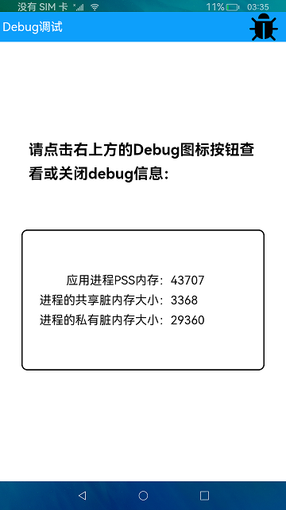

# Debug

### 概要简介

本示例通过使用hidebug，获取当前应用内存使用情况。实现效果如下：

 

### 相关概念

Debug调试：获取应用内存的使用情况，包括应用进程的静态堆内存（native heap）信息、应用进程内存占用PSS（Proportional Set Size）信息等； 可以完成虚拟机内存切片导出，虚拟机CPU
Profiling采集等操作。

Stack：堆叠容器，子组件按照顺序依次入栈，后一个子组件覆盖前一个子组件。

@Builder：@Builder装饰的方法用于定义组件的声明式UI描述，在一个自定义组件内快速生成多个布局内容。

### 相关权限

不涉及。

### 使用说明

1.点击界面右上方Debug图标，弹出Debug信息界面，显示当前应用内存使用情况。

2.再次点击右上方Debug图标，Debug信息界面消失。

### 约束与限制

1.本示例仅支持标准系统上运行。

2.本示例仅支持API9版本SDK，版本号：3.2.9.2。

3.本示例需要使用DevEco Studio 3.1 Canary1 (Build Version: 3.1.0.100)及以上才可编译运行。