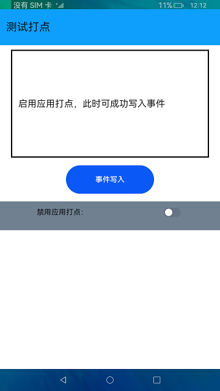

# 测试打点

### 介绍

本示例展示了在eTS中如何获取应用故障相关信息，测试打点包括应用打点与性能打点两部分，应用打点通过调用`hiAppEvent`接口来记录应用运行过程中发生的各种信息。具体介绍如下：

1.点击"事件写入"按钮，显示成功写入事件。

2.打开"禁用应用打点"开关，再次点击"事件写入"按钮，显示事件写入失败。

3.关闭"禁用应用打点"开关，再次点击"事件写入"按钮，显示事件写入成功。

### 效果预览

### 相关权限

不涉及。

### 依赖

不涉及。

### 约束与限制

1.本示例仅支持在标准系统上运行。

2.性能打点验证只能通过上述命令获取日志来进行验证。

3.本示例仅支持API version 9版本SDK，版本号：3.2.10.6。

4.本示例需要使用DevEco Studio 3.1 Canary1 (Build Version: 3.1.0.100)及以上才可编译运行。