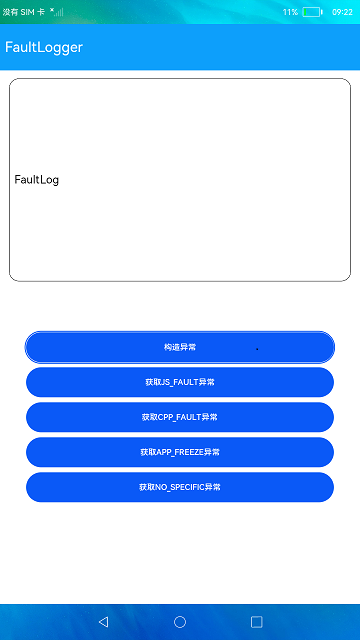

# 故障日志获取

### 介绍

本示例使用了faultLogger接口，展示了在eTS中如何获取应用故障相关信息。

使用说明：
1. 启动应用后，点击**构造异常**按钮，在弹窗中选择故障类型，点击确定可以构造异常场景。
2. 构造异常场景后，重新启动应用，点击下面不同的获取异常按钮可以获取到对应类型的异常日志并显示在页面文本框中。

### 效果预览

|主页|
|----------|
||

### 相关权限

不涉及。

### 依赖

不涉及。

### 约束与限制

1. 本示例仅支持标准系统上运行，支持设备：RK3568;
2. 本示例仅支持API9版本SDK，版本号：3.2.10.6
3. 本示例需要使用DevEco Studio 3.1 Canary1 (Build Version: 3.1.0.100, built on November 3, 2022)才可编译运行。

