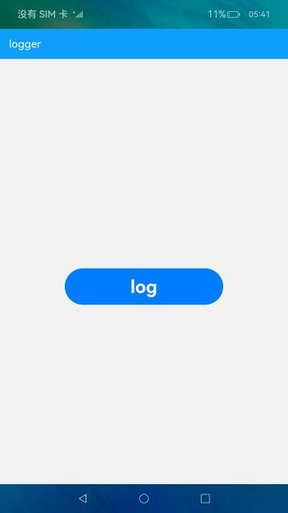

# 日志打印

### 介绍

本示例提供日志打印类，并将日志信息保存至应用安装目录下，方便开发者进行调试。

使用说明：
1. 点击log按钮即可输出日志。

### 效果预览

|主页|
|----------|
||

### 相关权限

不涉及。

### 依赖

不涉及。

### 约束与限制

1.本示例仅支持API9版本SDK，版本号：3.2.10.6;

2.本示例需要使用DevEco Studio 3.1 Canary1 (Build Version: 3.1.0.100)及以上才可编译运行。