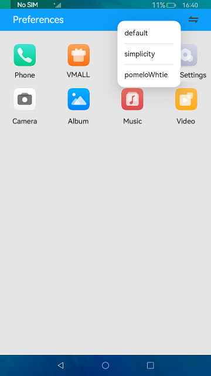

#  Preferences

### Introduction

This sample shows how to alternate between themes using preferences. The display effect is as follows:

### Concepts

Preferences: provide capabilities for processing data in the form of key-value (KV) pairs and support lightweight data persistence, modification, and query. In KV pairs, the keys are of the string type, and the values can be of the number, string, Boolean, Array\<number>, Array\<string>, or Array\<boolean> type.

### Required Permissions

N/A.

### Usage

1. Touch the switch button on the upper right corner of the title bar, and select the target theme from the screen displayed.

2. Exit the app and then access it again. The theme before the last exit is displayed.

### Constraints

- This sample can only be run on standard-system devices.

- This sample is based on the stage model, which is supported from API version 9.

- This sample requires DevEco Studio 3.1 Canary1 (Build Version: 3.1.0.100) to compile and run. 
