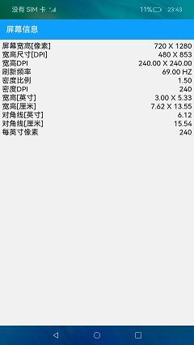

# 屏幕探测

### 介绍

本示例实时监测连接的屏幕数量状态，支持创建至多5个虚拟屏幕，点击对应的屏幕矩形能显示该屏幕的相关属性。

使用说明：

1.第一步：进入开始界面

2.第二步：点击右下方的“+”按钮，添加虚拟屏幕，连续点击后，至多创建5个虚拟屏幕。

3.第三步：点击右下方的“-”按钮，移除虚拟屏幕，连续点击删除全部的虚拟屏幕后，再次点击会提示告警信息。

4.第四步：点击屏幕矩形，展示相关屏幕的属性（首字母为R的为真实屏幕，首字母为V的为虚拟屏幕）

### 相关权限

无

### 依赖

无

### 约束与限制

1. 本示例仅支持标准系统上运行，支持设备：RK3568;
2. 本示例仅支持API9版本SDK，版本号：3.2.10.6；
3. 本示例需要使用DevEco Studio 3.1 Canary1 (Build Version: 3.1.0.100)才可编译运行；
