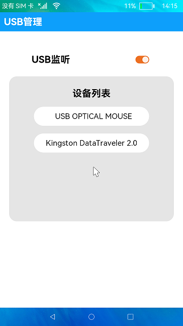

# USB管理

### 介绍

本示例展示了USB设备管理的使用，包括USB设备插拔状态监听和USB设备信息显示。

使用说明：

1. 打开**USB监听**开关，界面弹出"开始监听..."的提示（USB监听开关仅监听设备是否插入并弹窗进行提示）;
2. 插入设备，界面会有“USB已插入”的提示,设备列表会显示已插入设备的名称。如果列表没有及时更新，则可以下拉列表手动刷新;
3. 点击设备，弹框会显示该USB设备的具体信息，点击**确定**按钮返回主页面;
4. 将USB设备拔出，界面会有“已移除设备”的提示，设备列表会移除该名称的设备，如果列表没有及时更新，则可以下拉列表手动刷新。

### 效果预览

|首页|
|---------|
||

### 相关权限

不涉及。

### 依赖

不涉及。

### 约束与限制

1. 本示例仅支持在标准系统上运行;

2. 本示例仅支持API9版本SDK，版本号:3.2.10.6;

3. 本示例需要使用DevEco Studio 3.1 Canary1 (Build Version: 3.1.0.100)及以上才可编译运行。