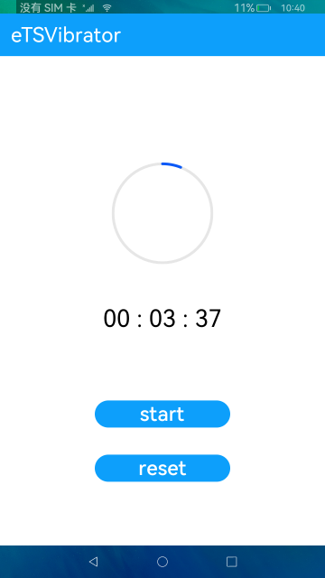

# 振动

### 简介

本示例模拟倒计时场景，展示振动接口的使用方法。实现效果如下：

### 相关概念

触发振动的两种方式：通过持续时间触发马达振动和通过振动效果触发马达振动。

### 相关权限

允许应用程序使用马达：ohos.permission.VIBRATE

### 使用说明

1.点击倒计时文本，弹出时间选择框，选择任意时间，点击**确认**，倒计时文本显示选择的时间。

2.点击**start**，开始倒计时，圆形进度条和文本开始变化；倒计时结束，开始振动，进度条恢复初始状态并且弹出振动提示框，按照描述进行选择。

3.点击**reset**，可以结束倒计时并使文本和进度条恢复初始状态。

### 约束与限制

1.本示例仅支持标准系统上运行。

2.本示例需要使用有振动器的设备测试。

3.本示例需要使用DevEco Studio 3.1 Canary1 (Build Version: 3.1.0.100)及以上才可编译运行。