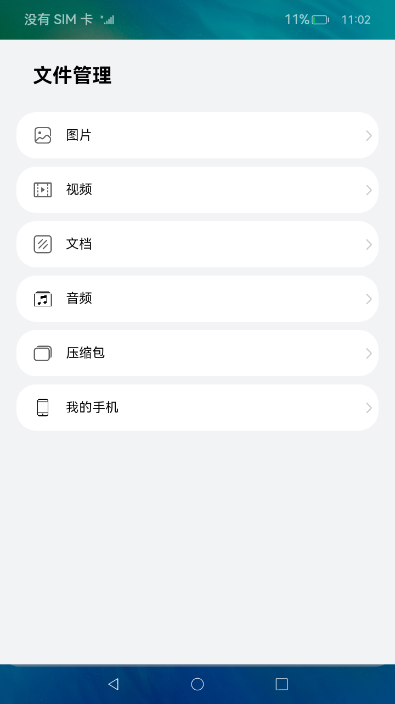
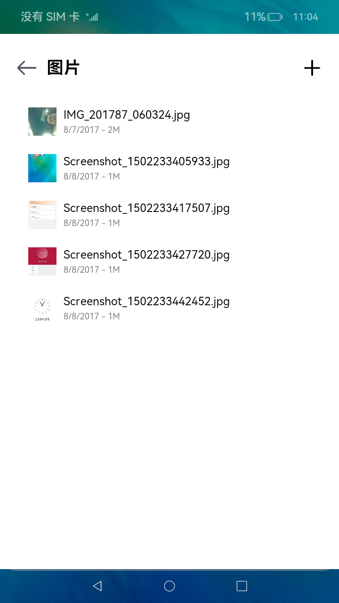
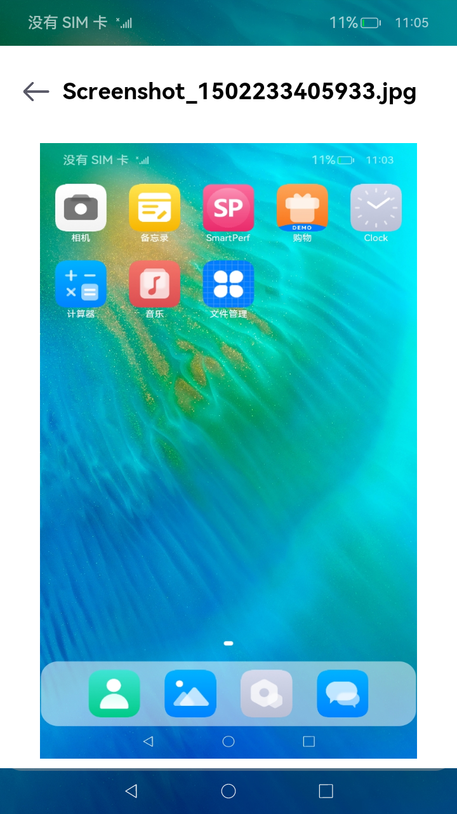
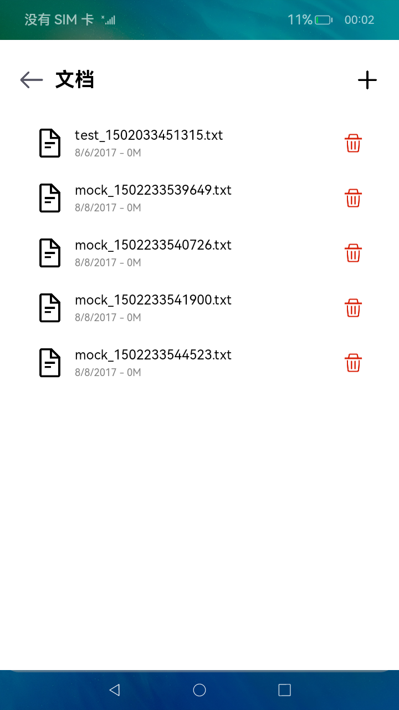

# 文件管理

### 介绍

本示例主要展示了文件管理相关的功能，使用[@ohos.multimedia.medialibrary](https://gitee.com/openharmony/docs/blob/master/zh-cn/application-dev/reference/apis/js-apis-medialibrary.md)
、[@ohos.filemanagement.userFileManager](https://gitee.com/openharmony/docs/blob/master/zh-cn/application-dev/reference/apis/js-apis-userFileManager.md)
、[@ohos.fileio](https://gitee.com/openharmony/docs/blob/master/zh-cn/application-dev/reference/apis/js-apis-fileio.md)
等接口，实现了增添文件、删除文件、查找指定类型文件文件、复制并移动文件和预览图片的功能;

### 效果预览

|首页|图片列表|图片预览|文档删除|
|--------------------------------|--------------------------------|--------------------------------|--------------------------------|
|||||

使用说明
1. 在主界面，可以点击图片、视频、文档、音频等按钮进入对应目录的文件列表浏览界面；
2. 在文件列表浏览界面，点击“+”按钮，可以添加文件；
3. 在文件列表浏览界面，长按列表项会出现删除图片，点击删除图标可以删除文件；
4. 在图片文件列表界面，点击图片可以进入图片预览界面。
5. 在主页点击“我的手机”，进入应用沙箱目录下。
   1. 点击左下角“新建文件夹”按钮，在弹窗中输入文件夹名称，点击弹窗中的“确定”按钮，完成创建。

   2. 点击新建的文件夹，进入目录，在新目录中点击左下角的“新建文件”，在弹窗的窗口中填写文件夹名称，然后点击确定，完成创建。

   3. 点击右上角多选按钮，选择需要重命名的文件（仅选中一个文件时可用），点击重命名，在弹窗中修改文件名称，点击“确定”，完成修改。

   4. 点击右上角多选按钮，选择需要复制和移动的文件（可多选，并且不可移动到本身的子目录下），选中后点击左下角“复制和移动”按钮，在页面中点击目标目录会进入该目录，在目标目录下点击“移动到这”按钮，完成文件复制和移动。

   5. 点击右上角多选按钮，选择需要删除的文件，选中后点击右下角“删除”按钮，在弹窗中点击“删除”，即可删除文件。

### 工程目录

```
entry/src/main/ets/
|---Application
|---filemanager
|   |---data
|   |   |---FileDataSource.ets             // 懒加载数据格式
|   |---pages
|   |   |---audio
|   |   |   |---AudioFileList.ets          // 音频列表页面
|   |   |---common
|   |   |   |---FileList.ets               // 同类型文件列表展示页面，接收文件类型，展示特定类型的文件列表
|   |   |---document
|   |   |   |---DocumentFileList.ets       // 文档列表页面
|   |   |---image
|   |   |   |---ImageFileList.ets          // 图片列表页面
|   |   |   |---ImagePreview.ets           // 图片预览页面
|   |   |---MyPhone
|   |   |   |---DeleteDialog.ets           // 删除时的询问弹窗
|   |   |   |---InputNameDialog.ets        // 新增文件时的输入框
|   |   |   |---MyPhone.ets                // MyPhone主页
|   |   |---video
|   |   |   |---VideoFileList.ets          // 视频列表页面
|   |   |---FileManagerHome.ets            // 首页主体内容
|---MainAbility
|---pages
|   |---index.ets                          // 首页
Library/src/main/ets/
|---filemanager
|   |---components
|   |   |---ThumbnailImage.ets             // 缩略图组件
|   |---fileio
|   |   |---FileIoManager.ts               // 文件管理模块，封装了fileio的接口，实现MyPhone部分的功能
|   |---medialibrary
|   |   |---MediaLibraryManager.ts         // 主要封装了mediaLibrary库相关的接口，实现相关功能，如：对文件的增、删、查和图片预览功能
|   |---userfilemanager
|   |   |---UserFileManager.ts             // 封装userFileManager库相关的接口
|   |---FileManager.ts                     // 文件管理接口，统一封装了各模块对外提供的功能接口
|---mock                                   // 本地数据
|---utils                                  // 日志工具
```

### 具体实现：

* 增添文件、删除文件、查找指定类型文件文件和预览图片的功能接口封装在MediaLibraryManager，源码参考：[MediaLibraryManager.ts](https://gitee.com/openharmony/applications_app_samples/blob/master/FileManager/FileManager/Library/src/main/ets/filemanager/medialibrary/MediaLibraryManager.ts)
    * 使用mediaLibrary.getMediaLibrary来获取MediaLibrary对象;
    * 读取每个文件的数据：使用MediaLibrary.getFileAssets读取满足条件的文件集合FetchFileResult，然后调用FetchFileResult.getFirstObject();
    * 创建模拟文件：使用MediaLibrary.getPublicDirectory()获取系统预定的目录，然后使用MediaLibrary.createAsset();
    * 删除指定路径的文件：使用MediaLibrary.deleteAsset();
    * 获取预览图：使用image.createImageSource()创建指定的文件资源ImageSource，然后调用ImageSource.createPixelMap()，接口参考：[@ohos.multimedia.image](https://gitee.com/openharmony/docs/blob/master/zh-cn/application-dev/reference/apis/js-apis-image.md) 。
    
* MyPhone模块中的文件增删、复制移动、查找功能封装在FileSystem，源码参考：[FileIoManager.ets](https://gitee.com/openharmony/applications_app_samples/blob/master/FileManager/FileManager/Library/src/main/ets/filemanager/fileio/FileIoManager.ets) 。
  * 读取文件列表：使用fileio.opendirSync()打开指定目录dir，然后使用dir.readSync()读取文件内容dirent，在调用dirent中相关api获取想要的文件参数;
  * 创建目录：使用fileio.mkdirSync()创建文件夹；
  * 创建文件：使用fileio.openSync()床架文件；
  * 删除选中内容：使用fileio.rmdirSync()删除文件夹，使用fileio.unlinkSync()删除文件；
  * 复制文件：使用fileio.copyFileSync()复制目标文件；
  * 移动文件：使用fileio.mkdirSync()创建指定目录，再递归选中目录中的文件，将内部的文件创建到指定的位置。

* 在Library模块中通过封装FileManager向外提供功能接口，如MediaLibraryManager.getPixelMapByFileAsset()，源码参考：[FileManager.ts](https://gitee.com/openharmony/applications_app_samples/blob/master/FileManager/FileManager/Library/src/main/ets/filemanager/FileManager.ts)
    * 如效果预览中的**图片列表**，读取指定类型的文件：在[FileList.ets](https://gitee.com/openharmony/applications_app_samples/blob/master/FileManager/FileManager/entry/src/main/ets/filemanager/pages/common/FileList.ets)
      中调用FileManager.getFileAssets()；
    * 创建模拟文件：在[FileList.ets](https://gitee.com/openharmony/applications_app_samples/blob/master/FileManager/FileManager/entry/src/main/ets/filemanager/pages/common/FileList.ets)
      中调用FileManager.createTxtFileAsset()；
    * 删除指定路径的文件：在[FileList.ets](https://gitee.com/openharmony/applications_app_samples/blob/master/FileManager/FileManager/entry/src/main/ets/filemanager/pages/common/FileList.ets)
      中调用FileManager.deleteFileAsset()；
    * 获取缩略图：在[ThumbnailImage.ets](https://gitee.com/openharmony/applications_app_samples/blob/master/FileManager/FileManager/Library/src/main/ets/filemanager/components/ThumbnailImage.ets) 中调用FileManager.getThumbnail()；
    * 如效果预览中的**图片预览**，获取预览图：在[ImagePreview.ets](https://gitee.com/openharmony/applications_app_samples/blob/master/FileManager/FileManager/entry/src/main/ets/filemanager/pages/image/ImagePreview.ets) 中调用FileManager.getPixelMapByFileAsset()。

### 相关权限

[ohos.permission.READ_MEDIA](https://gitee.com/openharmony/docs/blob/master/zh-cn/application-dev/security/permission-list.md#ohospermissionread_media)

[ohos.permission.WRITE_MEDIA](https://gitee.com/openharmony/docs/blob/master/zh-cn/application-dev/security/permission-list.md#ohospermissionwrite_media)

[ohos.permission.FILE_ACCESS_MANAGER](https://gitee.com/openharmony/docs/blob/master/zh-cn/application-dev/security/permission-list.md#ohospermissionfile_access_manager)

[ohos.permission.STORAGE_MANAGER](https://gitee.com/openharmony/docs/blob/master/zh-cn/application-dev/security/permission-list.md#ohospermissionstorage_manager)

### 依赖

不涉及

### 约束与限制

1. 本示例仅支持标准系统上运行，支持设备：RK3568;
2. 本示例仅支持API9版本SDK，版本号：3.2.9.2，本示例涉及使用系统接口：@ohos.multimedia.mediaLibrary中的deleteAsset接口，需要手动替换Full SDK才能编译通过，具体操作可参考[替换指南](https://docs.openharmony.cn/pages/v3.2/zh-cn/application-dev/quick-start/full-sdk-switch-guide.md/)；
3. 本示例需要使用DevEco Studio 3.1 Canary1 (Build Version: 3.1.0.100, built on November 3, 2022)才可编译运行；
4. 本示例涉及系统接口，需要配置系统应用签名，可以参考[特殊权限配置方法](https://docs.openharmony.cn/pages/v3.2/zh-cn/application-dev/security/hapsigntool-overview.md/)，把配置文件中的“app-feature”字段信息改为“hos_system_app”。

### 下载

如需单独下载本工程，执行如下命令：

    ```
    git init
    git config core.sparsecheckout true
    echo FileManager/FileManager/ > .git/info/sparse-checkout
    git remote add origin https://gitee.com/openharmony/applications_app_samples.git
    git pull origin master
    ```
