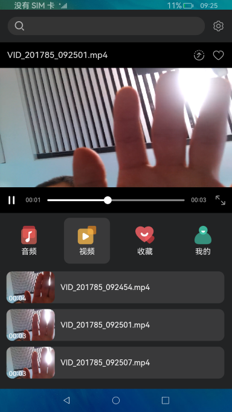
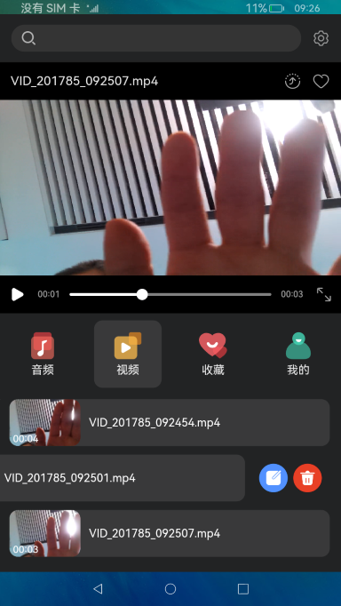

# 媒体管理合集

###  介绍

#### 具体功能

1. 网络流播放能力
2. 音视频播控能力
3. 音量调节能力

#### 主要实现原理

1. 使用媒体库接口进行音视频的扫描，获取音视频详细信息，重命名和删除操作。
2. 使用媒体服务进行音视频播放，暂停，seek等操作。
3. 使用屏幕管理接口获取设备宽度进行适配。

#### 使用说明

1. 启动应用，点击音频或视频可以查看本地音视频资源。若本地没有音视频资源，可以push视频到本地媒体库路径，视频路径(storage/media/100/local/files/Videos)  音频路径(storage/media/100/local/files/Audios)，需要先hdc进入storage/media/100/local/files路径下查看是否有Videos/Audios文件夹，没有则需要mkdir Videos/Audios创建文件夹后push音视频资源。
2. 进入首页，可以通过输入网络地址或点击音频，视频进行播放音视频。
3. 音视频播放后，对于播控按键显示，点击播放、暂停可以播放、暂停音视频，点击循环图标可以在单曲循环和列表循环进行切换。
4. 点击下一曲、上一曲可以切换音视频，拖动seek可以跳到指定位置播放，点击详细信息可以查看当前音视频信息，视频点击倍速可以开启倍速播放。
5. 音视频列表左滑可以开启重命名、删除图标，点击对应图标可以进行音视频的重命名和删除。

### 效果预览

        

    

### 相关权限

读取公共媒体文件权限：ohos.permission.READ_MEDIA、读写公共媒体文件权限：ohos.permission.WEITE_MEDIA

### 依赖

不涉及

### 约束与限制

1.本示例仅支持标准系统上运行，支持设备：RK3568。

2.本示例仅支持API9版本SDK，本示例涉及使用系统接口：getXComponentSurfaceId()，需要手动替换Full SDK才能编译通过，具体操作可参考[替换指南](https://docs.openharmony.cn/pages/v3.2/zh-cn/application-dev/quick-start/full-sdk-switch-guide.md/)。

3.本示例需要使用DevEco Studio 3.1 Canary1 (Build Version: 3.1.0.100)及以上才可编译运行。
