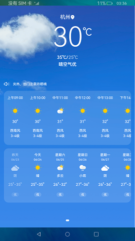
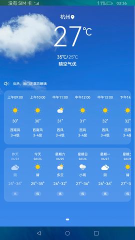

# Ability与ServiceExtensionAbility通信

### 介绍

本示例展示通过[IDL的方式](https://gitee.com/openharmony/docs/blob/master/zh-cn/application-dev/IDL/idl-guidelines.md#ts%E5%BC%80%E5%8F%91%E6%AD%A5%E9%AA%A4)实现了Ability与ServiceExtensionAbility之间的通信。

使用说明：

1.启动应用后，首页展示城市的天气信息，当前温度每隔5S会刷新一次。

效果预览：

 

### 相关权限

不涉及。

### 依赖

不涉及。

###  约束与限制

1.本示例仅支持标准系统上运行。

2.本示例为stage模型，仅支持API9版本SDK，版本号：3.2.10.6。

3.本示例需要使用DevEco Studio 3.1 Canary1 (Build Version: 3.1.0.100)才可编译运行。

4.本示例使用了ServiceExtensionAbility相关系统接口，需要替换Full SDK，使用Full SDK时需要手动从镜像站点获取，并在DevEco Studio中替换，具体操作可参考[替换指南](https://docs.openharmony.cn/pages/v3.2/zh-cn/application-dev/quick-start/full-sdk-switch-guide.md/)。

5.本示例使用了ServiceExtensionAbility，需要在签名证书UnsgnedReleasedProfileTemplate.json中配置"app-privilege-capabilities": ["AllowAppUsePrivilegeExtension"]，否则安装失败。具体操作指南可参考[应用特权配置指南](https://gitee.com/openharmony/docs/blob/eb73c9e9dcdd421131f33bb8ed6ddc030881d06f/zh-cn/device-dev/subsystems/subsys-app-privilege-config-guide.md)。

