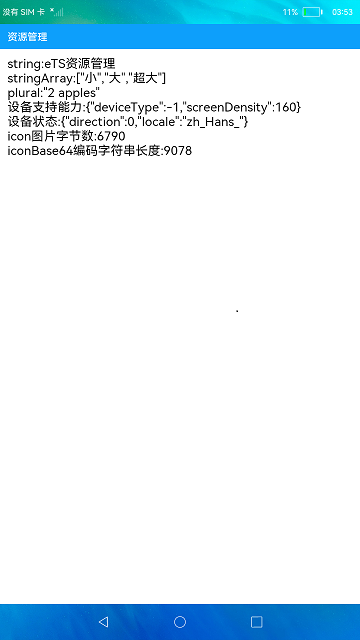

# 资源管理器

### 介绍

本示例调用资源管理@ohos.resourceManager的API接口实现字符串和图片资源信息的获取。

使用说明：

1. 应用界面中展示了资源管理API各类接口的调用，包括读取的字符串、字符串数组、根据指定数量获取指定ID字符串表示的单复数字符串，指定资源ID对应的媒体文件内容字节数、指定资源ID对应的图片资源Base64编码字符串的长度，以及获取设备状态和设备支持的能力。

### 效果预览

### 相关权限

不涉及。

### 依赖

不涉及。

### 约束与限制

1.本示例仅支持标准系统上运行。

2.本示例需要使用DevEco Studio 3.1 Canary1 (Build Version: 3.1.0.100, built on November 3, 2022)才可编译运行。

3.本示例仅支持API9版本SDK，版本号：3.2.10.6。