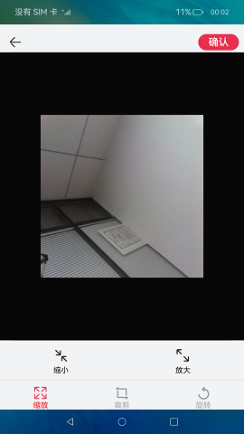
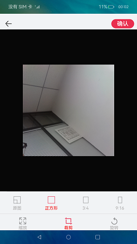
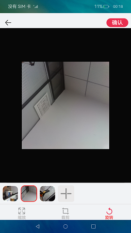

# 图片处理

### 介绍

本示例展示图片编辑相关功能。

本示例使用 [TextArea](https://gitee.com/openharmony/docs/blob/master/zh-cn/application-dev/reference/arkui-ts/ts-basic-components-textarea.md) 实现多文本输入，使用 [mediaLibrary](https://gitee.com/openharmony/docs/blob/master/zh-cn/application-dev/reference/apis/js-apis-mediaquery.md) 实现在相册中获取图片，使用 [image](https://gitee.com/openharmony/docs/blob/master/zh-cn/application-dev/reference/apis/js-apis-image.md) 生成pixelMap，使用pixelMap的scale()，crop()，rotate()接口实现对图片的缩放，裁剪，旋转功能。

使用说明： 

1.发表评价页面点击添加图片/照片，页面跳转到图片选择页面。

2.进入图片选择页面后，选择需要显示的图片，最多选择6张图片。

3.选中图片后点击下一步，页面会跳转到图片编辑页面，点击缩放，页面会显示缩小，放大按钮，点击按钮，可对图片进行缩小，放大操作。点击裁剪，页面会跳出裁剪比例，点击想要裁剪的比例可以对图片进行裁剪。点击旋转可对图片进行旋转。

4.图片编辑完成后，点击**确认**，页面会跳转到发表评价页面，显示相关照片。点击添加图片/照片可以对图片进行重新选择。

5.点击返回按钮，退出应用。

### 效果预览

  

### 相关权限

允许应用读取用户外部存储中的媒体文件信息：[ohos.permission.READ_MEDIA](https://gitee.com/openharmony/docs/blob/master/zh-cn/application-dev/security/permission-list.md)

允许应用读写用户外部存储中的媒体文件信息：[ohos.permission.WRITE_MEDIA](https://gitee.com/openharmony/docs/blob/master/zh-cn/application-dev/security/permission-list.md)

允许应用访问用户媒体文件中的地理位置信息：[ohos.permission.MEDIA_LOCATION](https://gitee.com/openharmony/docs/blob/master/zh-cn/application-dev/security/permission-list.md)

### 依赖

不涉及。

### 约束与限制

1.本示例仅支持标准系统上运行，支持设备：RK3568。

2.本示例为Stage模型，仅支持API9版本SDK，版本号：3.2.6.5。

3.本示例需要使用DevEco Studio 3.0 Beta4 (Build Version: 3.0.0.992, built on July 14, 2022)才可编译运行。