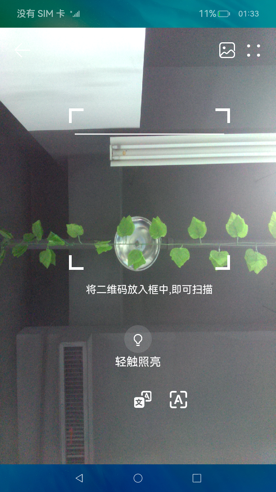
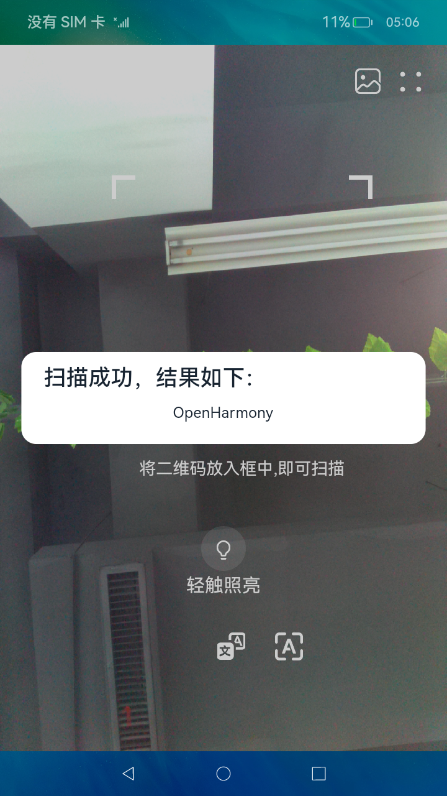

# 二维码扫描

### 介绍

本示例展示二维码扫描，从文件中选择二维码图片进行解析和读取，识别二维码信息。

本实例使用[媒体库管理](https://gitee.com/openharmony/docs/blob/master/zh-cn/application-dev/reference/apis/js-apis-medialibrary.md)、[相机管理](https://gitee.com/openharmony/docs/blob/master/zh-cn/application-dev/reference/apis/js-apis-camera.md)、[图片处理](https://gitee.com/openharmony/docs/blob/master/zh-cn/application-dev/reference/apis/js-apis-image.md)、[文件管理](https://gitee.com/openharmony/docs/blob/master/zh-cn/application-dev/reference/apis/js-apis-fileio.md)
  
1.启动应用，授予权限。

2.自动识别二维码图片。

3.点击右上角图片图标，在相册中选择对应的二维码图片，会返回首页展示结果。

### 效果预览
|首页                                    |选择图片                                           |结果展示                                      |
|---------------------------------------|--------------------------------------------------|--------------------------------------------|
| |||
  

### 相关权限

本示例需要在module.json5中配置如下权限:

读取公共媒体文件权限：[ohos.permission.READ_MEDIA](https://gitee.com/openharmony/docs/blob/master/zh-cn/application-dev/security/permission-list.md)

相机权限 [ohos.permission.CAMERA](https://gitee.com/openharmony/docs/blob/master/zh-cn/application-dev/security/permission-list.md)

本地资源读取权限 [ohos.permission.MEDIA_LOCATION](https://gitee.com/openharmony/docs/blob/master/zh-cn/application-dev/security/permission-list.md)

### 依赖

不涉及。

### 约束与限制

1.本示例仅支持标准系统上运行,支持设备:RK3568。

2.本示例仅支持API9版本SDK，本示例涉及使用系统接口：xcomponent.d.ts，需要手动替换Full SDK（3.2.10.6）才能编译通过，具体操作可参考[替换指南](https://docs.openharmony.cn/pages/v3.2/zh-cn/application-dev/quick-start/full-sdk-switch-guide.md/)。

3.本示例需要使用DevEco Studio 3.1 Canary1 (Build Version: 3.1.0.100)才可编译运行。
