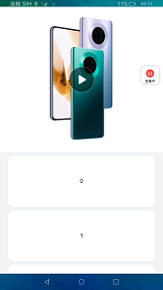

# 媒体库视频

### 介绍

本示例展示了视频组件的基本功能，以及如何控制播放状态的相关能力。包括视频组件化，全屏化，窗口化，上下轮播视频等。

本实例使用[Video组件](https://gitee.com/openharmony/docs/blob/master/zh-cn/application-dev/reference/arkui-ts/ts-media-components-video.md)

1.进入首页点击播放按键。

2.点击视频播放按钮，视频开始播放。再次点击视频进入视频全屏页。

3.首页下滑500vp后，视频小窗口化。

4.点击直播按钮进入直播页，上下滑动视频。

### 效果预览

 
 

### 相关权限

本示例需要在module.json5中配置如下权限:

网络使用权限：[ohos.permission.INTERNET](https://gitee.com/openharmony/docs/blob/master/zh-cn/application-dev/security/permission-list.md)

### 约束与限制

1.本示例仅支持标准系统上运行,支持设备:RK3568。

2.本示例仅支持API version 9版本SDK，版本号：3.2.10.6。

3.本示例需要使用DevEco Studio 3.1 Canary1 (Build Version: 3.1.0.100)及以上才可编译运行。