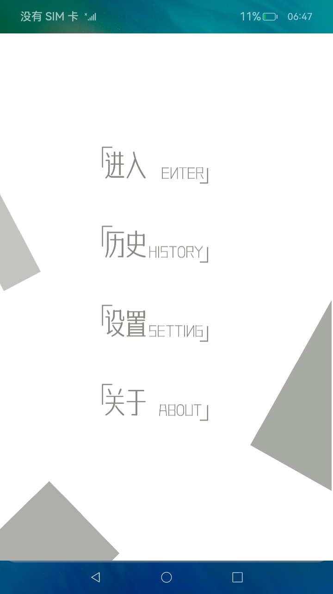

# 公共事件的订阅和发布

### 介绍

本示例主要展示了公共事件相关的功能，实现了一个检测用户部分行为的应用。具体而言实现了如下几点功能：

1.通过订阅系统公共事件，实现对用户操作行为（亮灭屏、断联网）的监测；

2.通过在用户主动停止监测行为时发布自定义[有序公共事件](https://gitee.com/openharmony/docs/blob/master/zh-cn/application-dev/application-models/common-event-overview.md)，实现对用户主动触发监听行为的持久化记录；

3.通过在用户设置对某一事件的监听状态时发布[粘性事件](https://gitee.com/openharmony/docs/blob/master/zh-cn/application-dev/application-models/common-event-overview.md)，记录下本次应用运行期间允许监听的事件列表，同时在应用退出时将临时允许的修改为不允许。

使用说明：

1.安装编译生成的hap包，桌面上显示应用图标如下，点击图标即可进入应用。

2.进入应用显示菜单页，可选择“进入”，“历史”，“设置”及“关于”几个选项。

3.点击“进入”后跳转至主页面，点击主页面“开始监控”按钮，将开始监听系统公共事件，并进行计时，此时按钮内容变更为“停止监听”；点击停止监听按钮，页面上将显示本次监听时长及监听期间收到的干扰信息汇总，并在页面右下角显示“查看详情”按钮，点击按钮将跳转至详情页，显示监听期间收到的干扰信息，应用当前仅监听了亮灭屏、断联网等用户可操作的系统公共事件，后续可根据需求快速扩展。

4.返回至应用菜单页面，点击“历史”可查看用户操作监听的历史记录，当前支持每次运行期间最多存储20条历史记录，超过20条后将删除历史数据。

5.返回至应用菜单页面，点击“设置”可进行具体系统事件的监听配置，应用提供了“一直”、“仅本次”及“从不”三个选项，其中“仅本次”选项是指本次应用运行期间将监听特定系统公共事件，应用退出后该选项将自动调整为“从不”。

6.返回至应用菜单页面，点击“关于”可查看应用版本信息及本示例的说明。

### 效果预览

| 主页                                 | 监控页面                           | 设置页面                               | 历史记录页面                          |
| ------------------------------------ | ---------------------------------- | -------------------------------------- | ------------------------------------- |
|  |  |  |  |

### 相关权限

[ohos.permission.COMMONEVENT_STICKY](https://gitee.com/openharmony/docs/blob/master/zh-cn/application-dev/security/permission-list.md)

### 约束与限制

1.本示例仅支持标准系统上运行。

2.本示例为Stage模型，从API version 9开始支持。

3.本示例需要使用DevEco Studio 3.1 Canary1 (Build Version: 3.1.0.100)及以上才可编译运行。

4.本示例运行需要具有系统应用签名，因此需要手动配置系统应用的权限签名(具体操作可查看[自动化签名方案](https://developer.harmonyos.com/cn/docs/documentation/doc-guides/ohos-auto-configuring-signature-information-0000001271659465))，需要注意的是，在修改签名json文件时，不需要调整“apl”字段，需要调整“app-feature”字段为“hos_system_app”。
