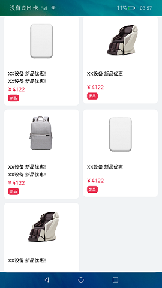
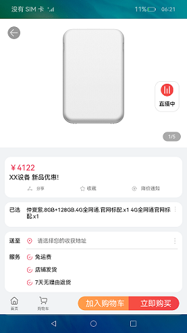
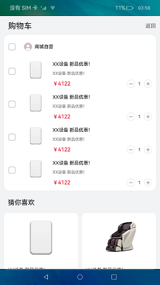

# 自定义Emitter

### 介绍

本实例使用了Emitter的事件单次订阅（emitter.once(eventId,call)）以及事件发布，结合**CustomDialogController**弹窗实现首页广告弹窗，首页采用Foreach循环生成商品列表；商品详情页的底部添加了导航和加入购物车功能，点击首页返回主页面，点击加入购物车会在购物车页面添加一条商品信息，点击购物车进入购物车页面；加入购物车功能使用了Emitter的事件持续订阅(emitter.on(eventId,call))以及事件发布结合AppStorage实现。

本实例使用[Emitter](https://gitee.com/openharmony/docs/blob/master/zh-cn/application-dev/reference/apis/js-apis-emitter.md)实现事件的订阅和发布。使用[自定义弹窗](https://gitee.com/openharmony/docs/blob/master/zh-cn/application-dev/reference/arkui-ts/ts-methods-custom-dialog-box.md)设置广告信息。

使用说明：

1、进入首页后弹出广告弹窗，点击即可关闭。

2、点击商品列表中的一个商品可以跳转到商品详情页。

3、在商品详情页点击首页可以返回到商品列表页，点击购物车可以跳转到购物车页面，点击加入购物车可以在购物车页面添加一条商品信息。

### 效果预览：

### 相关权限

不涉及。

### 依赖

[自定义弹窗](https://gitee.com/openharmony/app_samples/tree/master/ETSUI/UpgradePopup) 本示例的升级弹窗功能依赖此示例。

### 约束与限制

1.本示例仅支持标准系统上运行，支持设备：RK3568。

2.本示例仅支持API9版本SDK，版本号：3.2.10.6。

3.本示例需要使用DevEco Studio 3.1 Canary1 (Build Version: 3.1.0.100)及以上才可编译运行。