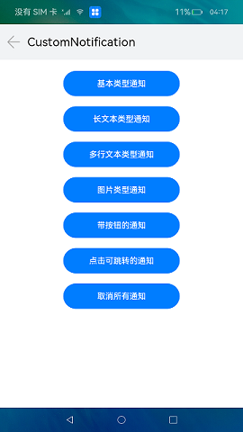
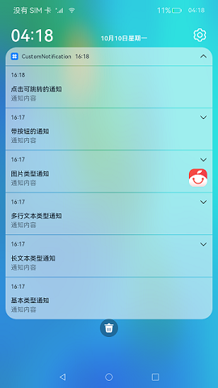
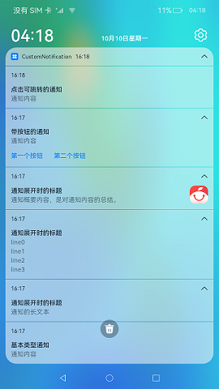

# 自定义通知

### 介绍

本示例展示了如何初始化不同类型通知的通知内容以及通知的发布、取消，包括基本类型、长文本类型、多行文本类型、图片类型、带按钮的通知、点击可跳转到应用的通知。

实现：

1.本示例参考[通知开发指导](https://gitee.com/openharmony/docs/blob/master/zh-cn/application-dev/notification/notification-guidelines.md) ，主要实现通知发送端的功能。

2.参照[Notification模块接口文档](https://gitee.com/openharmony/docs/blob/master/zh-cn/application-dev/reference/apis/js-apis-notification.md)，实现接口功能。

使用说明：

1.启动应用后，弹出是否允许发送通知的弹窗，点击允许后开始操作。

2.点击界面中对应的按钮发布不同类型的通知，下拉状态栏，在通知栏可以看到发布的通知。

3.点击取消所有通知，可以取消本应用发布的所有通知。

效果预览：

### 相关权限

不涉及。

### 依赖

不涉及。

###  约束与限制

1.本示例仅支持标准系统上运行。

2.本示例仅支持API9版本SDK，版本号：3.2.7.5 Beta3。

3.本示例需要使用DevEco Studio 3.0 Release (Build Version: 3.0.0.993, built on September 4, 2022)编译运行。

