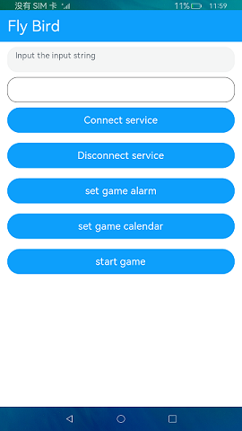
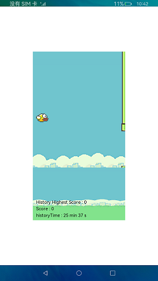

# 小鸟避障游戏

### 介绍

本示例用于验证OpenHarmony提供的Stage模型，Canvas组件做小游戏的能效是否符合预期，以及验证资源调度子系统的API接口是否符合后台规范运行的预期。具体操作如下：

1.点击**ConnectService**按钮，创建一个ServiceAbility并连接。

2.点击**DisconenctService**按钮，断开ServiceAbility。

3.点击**set game alarm**按钮，利用闹钟提醒代理API，验证游戏进程在收到闹铃通知时不被拉起。

4.点击**set game calendar**按钮，利用日历提醒代理API，验证游戏进程在收到日历通知时不被拉起。

5.点击**start game**按钮，选择对应的游戏难度1-5关玩游戏，游戏玩的过程中会利用后台信息统计API统计展示游戏在线时长。

6.点**home**按钮后，应用生命周期为onInactive, 在此回调中起一个短时任务，验证短时任务API能否正常执行。

### 效果预览

 

### 相关权限

后台持续运行: [ohos.permission.KEEP_BACKGROUND_RUNNING](https://gitee.com/openharmony/docs/blob/master/zh-cn/application-dev/security/permission-list.md)

查询其他应用的运行时间: [ohos.permission.BUNDLE_ACTIVE_INFO](https://gitee.com/openharmony/docs/blob/master/zh-cn/application-dev/security/permission-list.md)

读取用户存储: [ohos.permission.READ_USER_STORAGE](https://gitee.com/openharmony/docs/blob/master/zh-cn/application-dev/security/permission-list.md)

写入用户存储: [ohos.permission.WRITE_USER_STORAGE](https://gitee.com/openharmony/docs/blob/master/zh-cn/application-dev/security/permission-list.md)

后台代理提醒: [ohos.permission.PUBLISH_AGENT_REMINDER](https://gitee.com/openharmony/docs/blob/master/zh-cn/application-dev/security/permission-list.md)

### 依赖

不涉及。

### 约束与限制

1.本示例仅支持在标准系统上运行。

2.本示例仅支持API9版本SDK，版本号：3.2.9.2。

3.本示例需要使用DevEco Studio 3.1 Canary1 (Build Version: 3.1.0.100, built on November 3, 2022)才可编译运行。

4.本示例所配置的权限ohos.permission.BUNDLE_ACTIVE_INFO为system_basic级别(相关权限级别可通过[权限定义列表](https://gitee.com/openharmony/docs/blob/master/zh-cn/application-dev/security/permission-list.md)查看) ，需要手动配置对应级别的权限签名(具体操作可查看[自动化签名方案](https://docs.openharmony.cn/pages/v3.2/zh-cn/application-dev/security/hapsigntool-overview.md/)) 。

5.本示例需要使用@ohos.resourceschedule.usageStatistics、@ohos.app.ability.ServiceExtensionAbility系统权限的系统接口。使用Full SDK时需要手动从镜像站点获取，并在DevEco Studio中替换，具体操作可参考[替换指南](https://docs.openharmony.cn/pages/v3.2/zh-cn/application-dev/quick-start/full-sdk-switch-guide.md/)。
