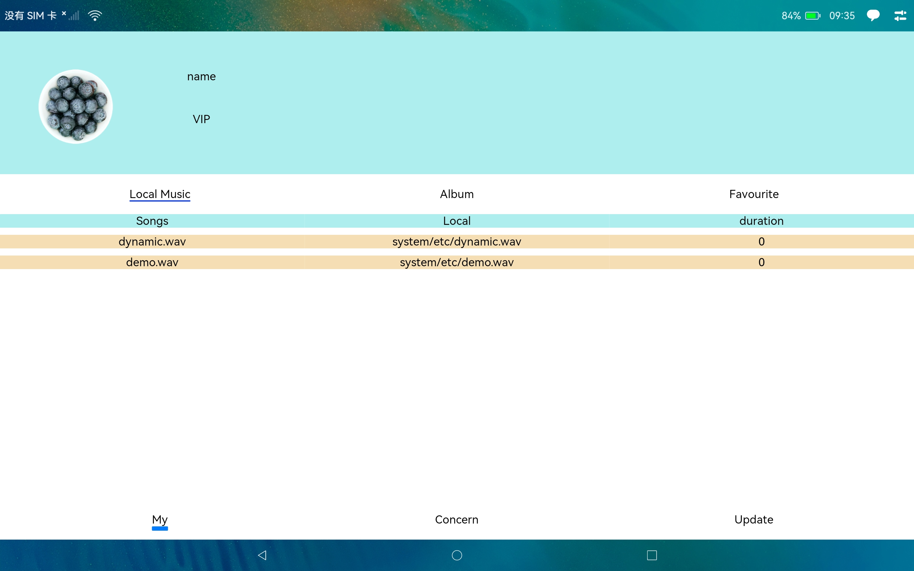
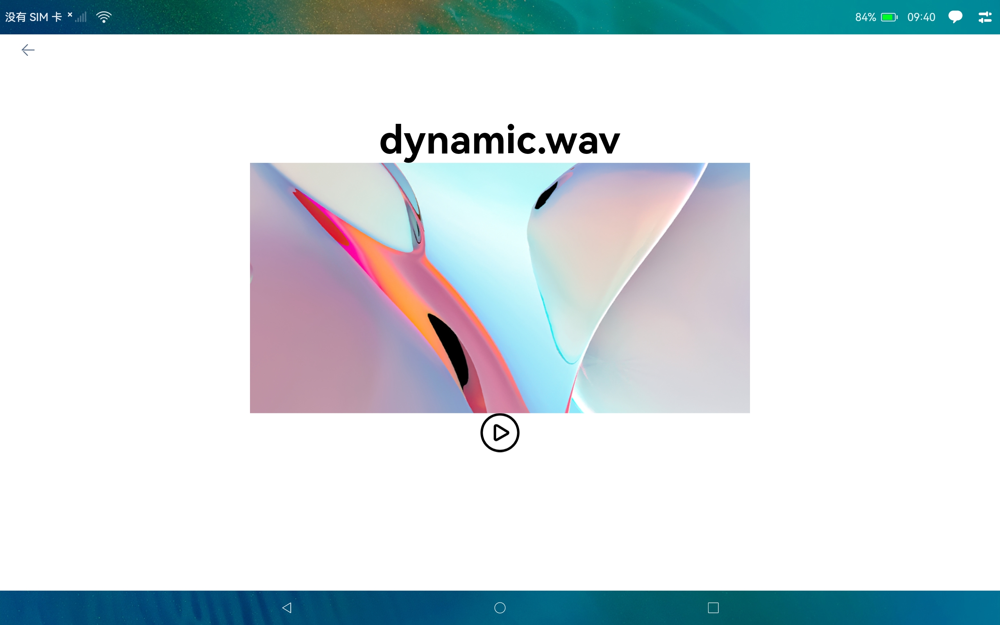

后台播放音乐
===============================

# 介绍 
本示例基于API9 stage应用开发模型，用于验证OpenHarmony提供的后台播放音乐时申请长时任务功能

1. 该示例简单使用了TAB组件、Page跳转进行布局和交互
2. 使用AudioPlayer组件进行音乐播放
3. 播放同时后台申请长时任务，停止播放时撤销长时任务，长时任务申请成功会在通知栏提示
4. 需在配置文件声明后台运行权限

使用说明：
1. 安装应用后找到应用“PlayBG”, 点击图标打开应用
2. 进入默认首页是'My'tab页，页面上有系统默认自带的2首歌曲，点击歌曲名称，例如点击dynamic.wav
3. 上一步操作会进入音乐播放详情页面，点击播放按钮，音乐开始播放
4. 音乐开始播放，在通知栏消息可以看到PlayBG消息，表明已成功申请长时任务在后台运行
5. 点击‘暂停’图标按钮，音乐停止播放，通知栏消息消失

# 效果预览

# 相关权限
示例应用申请权限, 详见示例工程module.json5文件
在entry/src/main/module.json5文件里申请:
1. 长时任务权限
    module节点申请:  
    "requestPermissions": [  
        {  
&ensp; &ensp; "name": "ohos.permission.KEEP_BACKGROUND_RUNNING"  // 长时任务权限  
        }  
    ]  
参考:https://gitee.com/openharmony/docs/blob/master/zh-cn/application-dev/task-management/continuous-task-dev-guide.md#%E5%9F%BA%E4%BA%8Estage%E6%A8%A1%E5%9E%8B
2. 媒体播放权限
   abilities节点申请:  
   "backgroundModes": ["audioPlayback"] // declare background mode  

# 依赖
1. 依赖avSession组件最新版本，2022/11/30正式发布sdk，在这之前可以使用sdk每日构建进行验证，每日构建地址如下:  
   http://ci.openharmony.cn/dailys/dailybuilds  
   替换avSession库，例如这里把下载好的xxx-ohos-sdk.tar.gz => ets => api => @ohos.multimedia.avsession.d.ts拷贝到你的工程sdk目录，例如我的目录是这个:  
   C:\Users\xxx\AppData\Local\OpenHarmony\Sdk\ets\3.2.7.5\api

# 约束与限制
本示例仅支持标准系统上运行，支持设备：RK3568;  
本示例仅支持API9版本SDK，版本号OpenHarmony3.2 beta3; API与SDK: API Version 9
本示例需要使用@ohos.multimedia.avsession系统权限的系统接口，使用Full SDK时需要手动从镜像站点获取，并在DevEco Studio中替换，具体操作可参考[替换指南](https://docs.openharmony.cn/pages/v3.2/zh-cn/application-dev/quick-start/full-sdk-switch-guide.md/)
本示例需要使用IDE: DevEco Studio 3.1 Canary1 Build Version: 3.1.0.100, built on November 3, 2022才可以编译运行
