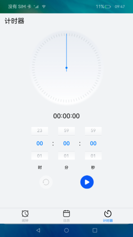

# 后台代理提醒

### 介绍

本示例通过使用后台代理提醒的能力，创建闹钟、日历、计时器三种类型的定时提醒，保证应用被冻结或退出时，计时和弹出提醒的功能可以被后台系统服务代理。

本示例使用 [Tabs组件](https://gitee.com/openharmony/docs/blob/master/zh-cn/application-dev/reference/arkui-ts/ts-container-tabs.md) 进行应用布局，使用 [Canvas组件](https://gitee.com/openharmony/docs/blob/master/zh-cn/application-dev/reference/arkui-ts/ts-components-canvas-canvas.md) 绘制时钟、倒计时，使用 [后台代理提醒](https://gitee.com/openharmony/docs/blob/master/zh-cn/application-dev/reference/apis/js-apis-reminderAgentManager.md) 发布后台代理提醒，使用 [振动](https://gitee.com/openharmony/docs/blob/master/zh-cn/application-dev/reference/apis/js-apis-vibrator.md) 设置振动效果。

使用说明：

1.点击**闹钟**、**日历**、**计时器**三个按钮或左右滑动切换不同视图。

2.1.点击闹钟页面右上角**+**按钮选择闹钟提醒时间添加闹钟提醒。

2.2.点击闹钟列表中可设置闹钟重复日期、延迟次数、延迟时长、是否震动、响铃音乐。

2.3.点击闹钟列表右侧开关按钮，可关闭或打开当前提醒。

2.4.右滑当前闹钟列表可选择删除当前提醒。

3.1.点击点击日历页面右上角**+**按钮选择日期提醒时间添加日期提醒。

3.2.点击日期列表中可设置日历提醒当天具体提醒时间、是否振动、是否响铃。

3.3.点击日历列表右侧开关按钮，可关闭或打开当前提醒。

3.4.右滑当前日历列表可选择删除当前提醒。

4.1.滑动计时器时间选项设置计时器时间。

4.2.点击**开始**按钮，开始当前计时器并设置倒计时后台提醒。

4.3.点击**重置**按钮，取消当前计时器提醒并重新设置计时器。

4.4.点击**暂停**按钮，暂停当前计时器提醒与倒计时；再次点击按钮恢复计时器提醒与计时器计时。

### 效果预览

  

### 相关权限

1.允许该应用使用后台代理提醒 [ohos.permission.PUBLISH_AGENT_REMINDER](https://gitee.com/openharmony/docs/blob/master/zh-cn/application-dev/security/permission-list.md)

2.允许应用控制马达振动 [ohos.permission.VIBRATE](https://gitee.com/openharmony/docs/blob/master/zh-cn/application-dev/security/permission-list.md)

3.允许应用读取用户外部存储中的媒体文件信息 [ohos.permission.READ_MEDIA](https://gitee.com/openharmony/docs/blob/master/zh-cn/application-dev/security/permission-list.md)

### 依赖

不涉及。

### 约束与限制

1.本示例仅支持标准系统上运行，支持设备：RK3568。

2.本示例仅支持API9版本SDK，版本号：3.2.10.6。

3.本示例需要使用DevEco Studio 3.1 Canary1 (Build Version: 3.1.0.100)及以上才可编译运行。