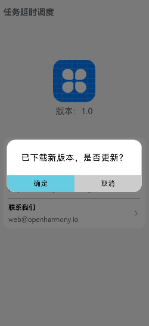
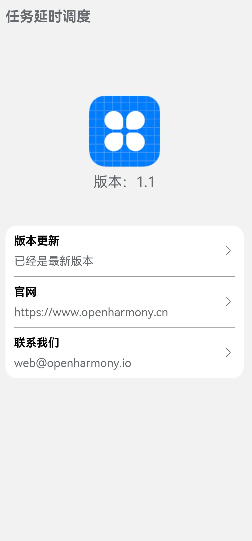

# 任务延时调度

### 介绍

本示例使用[@ohos.WorkSchedulerExtensionAbility](https://gitee.com/openharmony/docs/blob/master/zh-cn/application-dev/reference/apis/js-apis-WorkSchedulerExtensionAbility.md) 
、[@ohos.net.http](https://gitee.com/openharmony/docs/blob/master/zh-cn/application-dev/reference/apis/js-apis-http.md) 
、[@ohos.notification](https://gitee.com/openharmony/docs/blob/master/zh-cn/application-dev/reference/apis/js-apis-notification.md) 
、[@ohos.bundle](https://gitee.com/openharmony/docs/blob/master/zh-cn/application-dev/reference/apis/js-apis-Bundle.md)
、[@ohos.fileio](https://gitee.com/openharmony/docs/blob/master/zh-cn/application-dev/reference/apis/js-apis-fileio.md) 等接口，实现了设置后台任务、下载更新包
、保存更新包、发送通知 、安装更新包实现升级的功能。

### 效果预览

|当前版本首页                             |提示弹窗                                 |最新版本                                |
|---------------------------------------|---------------------------------------|---------------------------------------|
||||

使用说明

1. 未连接wifi状态下进入应用；
2. 进入首页后连接wifi；
3. 后台判断版本号后会下载最新的升级包，并在页面中给出弹窗询问是否安装，点击“确定”按钮；
4. 应用会安装已经下载的升级包，实现版本更新，安装后会回到设备桌面，此时点击应用图标，可以看到版本已经是最新版了。

### 工程目录
```
entry/src/main/ets/
|---Application
|   |---MyAbilityStage.ets                  // 入口文件
|---feature
|   |---WorkSchedulerSystem.ets             // 封装各个功能接口
|---MainAbility
|   |---MainAbility.ets                     // 请求权限
|---pages
|   |---Index.ets                           // 首页
|---util
|   |---Logger.ets                          // 日志文件
|---WorkSchedulerAbility
|   |---WorkSchedulerAbility.ets            // 延时任务触发后的回调
```

### 具体实现

* 设置延时任务、下载更新包、保存更新包、发送通知、安装更新包的功能接口都封装在WorkSchedulerSystem中，
源码参考：[WorkSchedulerSystem.ets](https://gitee.com/openharmony/applications_app_samples/blob/master/code/BasicFeature/TaskManagement/WorkScheduler/entry/src/main/ets/feature/WorkSchedulerSystem.ets)
  
  * 设置延时任务：在运行示例时会在[MainAbility.ets](https://gitee.com/openharmony/applications_app_samples/blob/master/code/BasicFeature/TaskManagement/WorkScheduler/entry/src/main/ets/MainAbility/MainAbility.ets)
  通过WorkSchedulerSystem.startUpdateSample()方法调用workScheduler.startWork()建立任务；
  * 下载更新包：当任务条件满足后，会在[WorkSchedulerAbility.ets](https://gitee.com/openharmony/applications_app_samples/blob/master/code/BasicFeature/TaskManagement/WorkScheduler/entry/src/main/ets/WorkSchedulerAbility/WorkSchedulerAbility.ets)
  通过WorkSchedulerSystem.getNewHap()方法调用http.createHttp().request()接口下载我们需要的文件；
  * 保存更新包：通过WorkSchedulerSystem.saveFile()来实现，受限调用fileio.openSync()创建文件，然后调用fileio.writeSync()将下载的内容写入指定文件内；
  * 发送通知：在[WorkSchedulerAbility.ets](https://gitee.com/openharmony/applications_app_samples/blob/master/code/BasicFeature/TaskManagement/WorkScheduler/entry/src/main/ets/WorkSchedulerAbility/WorkSchedulerAbility.ets)
  中通过WorkSchedulerSystem.publishNotification()方法，调用Notification.publish()接口发送指定内容的信息；
  * 接收通知：在[MainAbility.ets](https://gitee.com/openharmony/applications_app_samples/blob/master/code/BasicFeature/TaskManagement/WorkScheduler/entry/src/main/ets/MainAbility/MainAbility.ets)
  中通过WorkSchedulerSystem.handleNotification()方法调用Notification.subscribe()接口获取信息，根据信息内容决定是否提示用户升级；
  * 安装更新包：在[WorkSchedulerAbility.ets](https://gitee.com/openharmony/applications_app_samples/blob/master/code/BasicFeature/TaskManagement/WorkScheduler/entry/src/main/ets/WorkSchedulerAbility/WorkSchedulerAbility.ets)
  通过WorkSchedulerSystem.installBundle()方法实现，首先调用bundle.getBundleInstaller()获取Installer对象，然后调用bundleInstall.install()接口实现装包，完成升级。

### 相关权限

[ohos.permission.INTERNET](https://gitee.com/openharmony/docs/blob/master/zh-cn/application-dev/security/permission-list.md#ohospermissioninternet)

[ohos.permission.INSTALL_BUNDLE](https://gitee.com/openharmony/docs/blob/master/zh-cn/application-dev/security/permission-list.md#ohospermissioninstall_bundle)

[ohos.permission.NOTIFICATION_CONTROLLER](https://gitee.com/openharmony/docs/blob/master/zh-cn/application-dev/security/permission-list.md#ohospermissionnotification_controller)

### 依赖

不涉及。

### 约束与限制

1. 本示例仅支持标准系统上运行。

2. 本示例仅支持API9版本SDK，本示例涉及使用系统接口：@ohos.bundle，需要手动替换Full
  SDK才能编译通过，具体操作可参考[替换指南](https://docs.openharmony.cn/pages/v3.2/zh-cn/application-dev/quick-start/full-sdk-switch-guide.md/)。

3. 本示例需要使用DevEco Studio 3.1 Canary1 (Build Version: 3.1.0.100, built on November 3, 2022)才可编译运行。

4. 本示例所配置的权限ohos.permission.INSTALL_BUNDLE与ohos.permission.NOTIFICATION_CONTROLLER为system_core级别(
  相关权限级别可通过[权限定义列表](https://gitee.com/openharmony/docs/blob/master/zh-cn/application-dev/security/permission-list.md)查看)，需要手动配置对应级别的权限签名(具体操作可查看[自动化签名方案](https://developer.harmonyos.com/cn/docs/documentation/doc-guides/ohos-auto-configuring-signature-information-0000001271659465))。

### 下载

如需单独下载本工程，执行如下命令：

    ```
    git init
    git config core.sparsecheckout true
    echo code/BasicFeature/TaskManagement/WorkScheduler/ > .git/info/sparse-checkout
    git remote add origin https://gitee.com/openharmony/applications_app_samples.git
    git pull origin master
    ```
