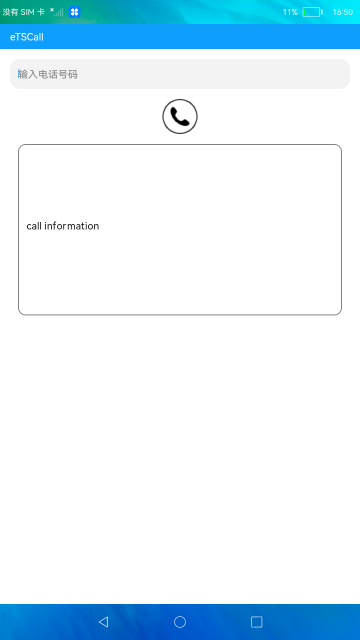

# 拨打电话

### 介绍

本示例使用[call](https://gitee.com/openharmony/docs/blob/master/zh-cn/application-dev/reference/apis/js-apis-call.md)相关接口实现了拨打电话并显示电话相关信息的功能

使用说明

1.输入电话号码后，点击**电话**按钮，进行拨打电话。

2.拨打电话后文本框会显示拨打是否成功，是否存在通话，通话状态，是否紧急号码，格式化后的电话号码。

### 效果预览

|主页|
|--------------------------------|
||

### 相关权限

拨打电话权限: [ohos.permission.PLACE_CALL](https://gitee.com/openharmony/docs/blob/master/zh-cn/application-dev/security/permission-list.md)

### 依赖

不涉及。

### 约束与限制

1.本示例仅支持在标准系统上运行。

2.本示例需要插入SIM卡，目前该功能仅支持部分机型。

3.本示例仅支持API9版本SDK，版本号：3.2.10.6。

4.本示例需要使用DevEco Studio 3.1 Canary1 (Build Version: 3.1.0.100)及以上才可编译运行。

5.本示例所配置的权限ohos.permission.PLACE_CALL为system_basic级别(相关权限级别可通过[权限定义列表](https://gitee.com/openharmony/docs/blob/master/zh-cn/application-dev/security/permission-list.md)查看)，需要手动配置对应级别的权限签名(具体操作可查看[自动化签名方案](https://docs.openharmony.cn/pages/v3.2/zh-cn/application-dev/security/hapsigntool-overview.md/))。
