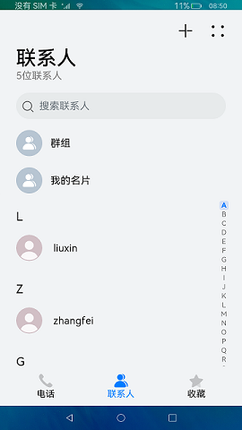
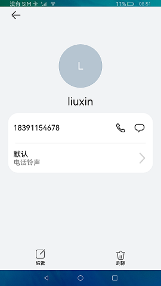

# Contact

### Introduction

This sample shows how to use the mobile phone contact function.

In this example, we'll use the [Tabs](https://gitee.com/openharmony/docs/blob/master/en/application-dev/reference/arkui-ts/ts-container-tabs.md) component to set the overall application layout, and use the [List](https://gitee.com/openharmony/docs/blob/master/en/application-dev/reference/arkui-ts/ts-container-list.md) component to set the page layout of the home page, and use the [AlphabetIndexer](https://gitee.com/openharmony/docs/blob/master/en/application-dev/reference/arkui-ts/ts-container-alphabet-indexer.md) component to set the index bar.

Usage

1. Touch **+** to go to the page for adding a contact. Enter the contact information, and then tap **√** to confirm and return to the home page.

2. Touch the contact list to view the detailed contact information. You can also edit or delete the contact information as needed.

3. Enter a number or email address in the search box to search for a contact.

### Display Effect

 

### Required Permissions

Reading of contact information: [ohos.permission.READ_CONTACTS](https://gitee.com/openharmony/docs/blob/master/en/application-dev/security/permission-list.md)

Adding, removing, and changing contact information: [ohos.permission.WRITE_CONTACTS](https://gitee.com/openharmony/docs/blob/master/en/application-dev/security/permission-list.md)

### Dependency

N/A

### Constraints

1. This sample can only be run on standard-system devices that use the Rockchip RK3568 chip.

2. DevEco Studio 3.0 Beta4 (Build version: 3.0.0.992, built on July 14, 2022) must be used.

3. [ohos.permission.READ_CONTACTS](https://gitee.com/openharmony/docs/blob/master/en/application-dev/security/permission-list.md) and [ohos.permission.WRITE_CONTACTS](https://gitee.com/openharmony/docs/blob/master/en/application-dev/security/permission-list.md) are permissions of the system_basic level, which can be viewed from the permission list (https://gitee.com/openharmony/docs/blob/master/en/application-dev/security/permission-list.md). You need to manually configure the signature of the corresponding permission level by following instructions in [Having Your App Automatically Signed](https://docs.openharmony.cn/pages/v3.2Beta/en/application-dev/security/hapsigntool-overview.md/).
