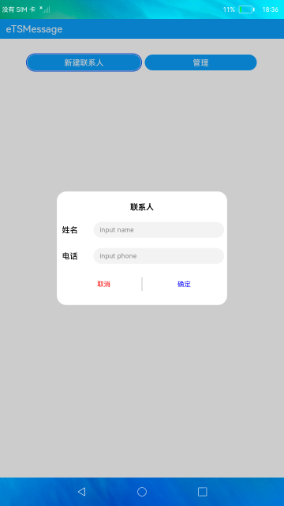
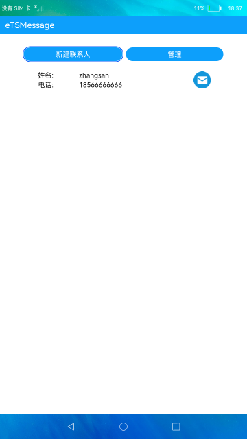
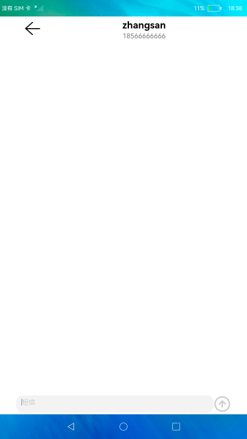

# 短信服务

### 简介

本示例展示了电话服务中发送短信的功能。

使用说明：

1. 首页点击**创建联系人**，弹框输入联系人姓名和电话，点击确定按钮后，联系人列表中添加该联系人。
2. 点击**管理**，该按钮变成**取消**，联系人列表出现删除x按钮，点击x按钮可删除联系人，点击**取消**，按钮变成**管理**。
3. 联系人列表中每个联系人右侧有**发送短信**图标按钮，点击该图标按钮跳转到发送短信页面。
4. 发送短信页面，输入短信点击向上箭头的**发送**按钮，可以发送短信。
5. 需授予短信发送权限且插入SIM卡才可成功发送短信，有预置短信内容，每次退出应用数据会清空，未添加存储功能，发送短信为默认卡发送。

### 效果预览
|新建联系人|首页|短信页|
|-------------|-----------|------------|

|| | |

### 相关权限

发送短信权限：[ohos.permission.SEND_MESSAGES](https://gitee.com/openharmony/docs/blob/master/zh-cn/application-dev/security/permission-list.md#ohospermissionsend_messages)

设置通话状态权限：[ohos.permission.SET_TELEPHONY_STATE](https://gitee.com/openharmony/docs/blob/master/zh-cn/application-dev/security/permission-list.md#ohospermissionset_telephony_state)

### 约束与限制

1. 本示例仅支持在标准系统上运行;
2. 本示例需要插入SIM卡，目前该功能仅支持部分机型;
3. 本示例仅支持API9版本SDK，版本号：3.2.10.6;
4. 本示例涉及使用系统接口：getSmscAddr()，需要手动替换[Full SDK](https://docs.openharmony.cn/pages/v3.2/zh-cn/release-notes/OpenHarmony-v3.2-beta4.md/)才能编译通过，具体操作可参考[替换指南](https://docs.openharmony.cn/pages/v3.2/zh-cn/application-dev/quick-start/full-sdk-switch-guide.md/);
5. 本示例需要使用DevEco Studio 3.1 Canary1 (Build Version: 3.1.0.100, built on November 3, 2022)才可编译运行;
6. 本示例所配置的权限ohos.permission.SEND_MESSAGES、ohos.permission.SET_TELEPHONY_STATE、ohos.permission.GET_TELEPHONY_STATE为system_basic级别(相关权限级别可通过[权限定义列表](https://gitee.com/openharmony/docs/blob/master/zh-cn/application-dev/security/permission-list.md)查看)，需要手动配置对应级别的权限签名(具体操作可查看[自动化签名方案](https://docs.openharmony.cn/pages/v3.2/zh-cn/application-dev/security/hapsigntool-overview.md/))。
