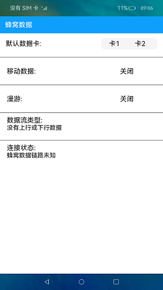

# 蜂窝数据

### 介绍

本示例通过获取SIM卡相关信息，展示打开本应用时网络信息。

本示例使用 [@Builder](https://gitee.com/openharmony/docs/blob/master/zh-cn/application-dev/ui/ts-component-based-builder.md) 在一个自定义组件内快速生成多个布局内容。

本示例使用 [SystemCapability.Telephony.CellularData系统能力](https://gitee.com/openharmony/docs/blob/master/zh-cn/application-dev/reference/apis/js-apis-telephony-data.md) 获取SIM卡信息及网络信息。

使用说明：

1.默认移动数据的SIM卡背景色显示为蓝色。

2.若已经开启移动数据，则显示开启，否则显示为关闭。

3.若已经开启漫游服务，则显示开启，否则显示为关闭。

4.显示打开本应用时数据流类型及连接状态。

### 效果预览

### 依赖

不涉及。

### 相关权限

网络服务：[ohos.permission.GET_NETWORK_INFO](https://gitee.com/openharmony/docs/blob/master/zh-cn/application-dev/security/permission-list.md)

### 约束与限制

1.本示例仅支持标准系统上运行，支持设备：仅支持部分机型。

2.本示例仅支持API9版本SDK，版本号：3.2.5.5 Beta2。

3.本示例需要使用DevEco Studio 3.0 Beta4 (Build Version: 3.0.0.992, built on July 14, 2022)才可编译运行。

4.本示例需设备支持SIM卡功能，且插入SIM卡。