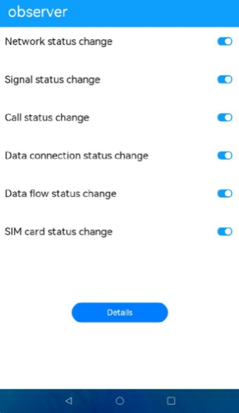

# Observer

### Overview

This sample demonstrates how to use observer APIs to subscribe to events of network status, signal status, call status, cellular data, and SIM card status changes.

### Concepts

`@ohos.telephony.observer`

  A module that allows you to register observers to subscribe to events of mobile network, signal, call, and SIM card status changes.

### Required Permissions

The following permission must be declared in the `module.json5` file:

**ohos.permission.GET_NETWORK_INFO**: Obtains the network status.

**ohos.permission.READ_CALL_LOG**: Obtains the call status.

### How to Use

1. Open the application and enable all event subscription switches.

2. Enable or disable the mobile network once to trigger a network status change.

3. Make a call to trigger a call status change.

4. Remove and insert the SIM card to trigger a SIM card status and signal status change.

5. Touch the **Details** button. A page is displayed, showing the related status change events.

### Constraints

1. This sample can only be run on standard-system devices.

2. This sample demonstrates the stage model, which supports only API version 9.

3. This sample requires DevEco Studio 3.0 Beta4 (Build Version: 3.0.0.992, built on July 14, 2022) to compile and run.
