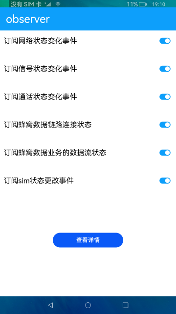

# observer

### 简介

本示例通过observer接口订阅网络状态、信号状态、通话状态、蜂窝数据、sim状态等事件，并获取状态变化返回的结果。

### 相关概念

observer: 通过注册相关监听事件，来监听手机网络、信号、通话、sim卡等状态，并返回相应的结果。

### 相关权限

获取网络状态权限:ohos.permission.GET_NETWORK_INFO

获取通话状态权限:ohos.permission.READ_CALL_LOG

### 使用说明

1.打开应用，开启所有订阅事件开关。

2.开关一次网络，触发网络状态变化。

3.拨打一次电话，触发通话状态变化。

4.插拔一次sim卡，触发sim卡状态变化和信号状态变化。

5.点击**查看详情**按钮，跳转详情页，显示监听到的数据结果。

### 约束与限制

1.本示例仅支持标准系统上运行。

2.本示例需要插入SIM卡，目前该功能仅支持部分机型。

3.本示例为Stage模型，从API version 9开始支持。

4.本示例需要使用DevEco Studio 3.0 Beta4 (Build Version: 3.0.0.992, built on July 14, 2022)才可编译运行。

5.本示例所配置的权限ohos.permission.READ_CALL_LOG为system_basic级别(相关权限级别可通过[权限定义列表](https://gitee.com/openharmony/docs/blob/master/zh-cn/application-dev/security/permission-list.md)查看)，需要手动配置对应级别的权限签名(具体操作可查看[自动化签名方案](https://docs.openharmony.cn/pages/v3.2/zh-cn/application-dev/security/hapsigntool-overview.md/))。
