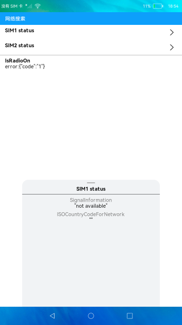

# 网络搜索

### 介绍

本示例通过eTS来展示电话服务中网络搜索功能，包含无线接入技术、网络状态、选网模式、ISO国家码、信号强度信息列表及Radio是否打开。

1.点击**SIM1 status**，弹出面板显示卡1的无线接入技术、注册网络信号强度信息列表、选网模式、ISO国家码，
再次点击面板消失， 点击**SIM2 status**显示同理。

2.**NetworkState**显示网络状态相关信息。

3.**IsRadioOn**显示Radio是否打开，true为打开，false为关闭。

### 效果预览

### 相关权限

获取网络信息权限：[ohos.permission.GET_NETWORK_INFO](https://gitee.com/openharmony/docs/blob/master/zh-cn/application-dev/security/permission-list.md)

### 依赖

不涉及。

### 约束与限制

1.本示例仅支持在标准系统上运行。

2.本示例需要插入SIM卡，目前该功能仅支持部分机型。

3.本示例仅支持API9版本SDK，版本号：3.2.9.2。

4.本示例需要使用DevEco Studio 3.1 Canary1 (Build Version: 3.1.0.100, built on November 3, 2022)才可编译运行。