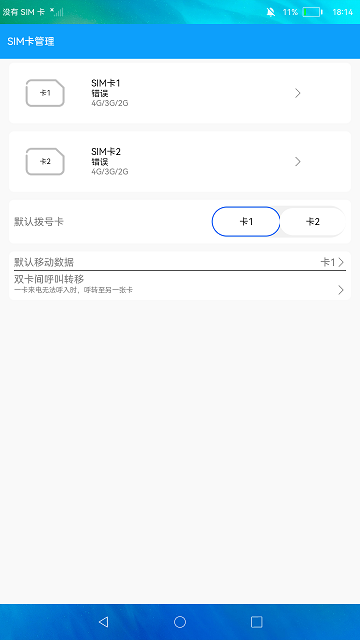

# SIM卡管理

### 简介

本示例使用[sim](https://gitee.com/openharmony/docs/blob/master/zh-cn/application-dev/reference/apis/js-apis-sim.md)相关接口，展示了电话服务中SIM卡相关功能，包含SIM卡的服务提供商、ISO国家码、归属PLMN号信息，以及默认语音卡功能。

使用说明：

1.若SIM卡槽1插入SIM卡则SIM卡1区域显示为蓝色，否则默认为白色。

2.点击SIM卡1区域，弹窗显示SIM卡1的相关信息，再次点击面板消失。

3.默认拨号的SIM卡其按钮背景色为蓝色，目前只展示默认拨号的SIM卡，更改默认拨号卡功能暂不支持。

4.呼叫转移界面功能暂不支持，故点击按钮无实际操作。

### 效果预览

|主页|
|--------------------------------|
||

### 相关权限

电话权限：[ohos.permission.GET_TELEPHONY_STATE](https://gitee.com/openharmony/docs/blob/master/zh-cn/application-dev/security/permission-list.md)

### 依赖

不涉及。

### 约束与限制

1.本示例暂不支持双卡功能，且需要插入SIM卡，目前该功能仅支持部分机型。

2.本示例仅支持在标准系统上运行。

3.本示例仅支持API9版本SDK，版本号：3.2.10.6。

4.本示例需要使用DevEco Studio 3.1 Canary1 (Build Version: 3.1.0.100, built on November 3, 2022)才可编译运行。

5.本示例所配置的权限ohos.permission.GET_TELEPHONY_STATE为system_basic级别(相关权限级别可通过[权限定义列表](https://gitee.com/openharmony/docs/blob/master/zh-cn/application-dev/security/permission-list.md)查看)，需要手动配置对应级别的权限签名(具体操作可查看[自动化签名方案](https://docs.openharmony.cn/pages/v3.2/zh-cn/application-dev/security/hapsigntool-overview.md/))。
