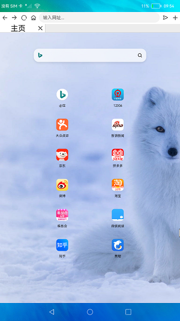

# 浏览器

### 简介

本示例运用系统提供的Stage模型与相关接口展示了一个简易的浏览器。实现效果如下： 

### 相关概念

系统属性：获取或设置系统属性Key对应的值。

媒体查询：设置媒体查询的查询条件，并返回对应的监听句柄。

### 相关权限

网络服务：ohos.permission.INTERNET

获取WLAN信息：ohos.permission.GET_WIFI_INFO

### 使用说明

1.连接Wifi，启动应用，展示默认页面内容。

2.点击默认页面的图标跳转到对应网页，或者在输入框输入网址，点击右侧跳转按钮跳转到对应网页。

3.点击输入框左侧向右向左按钮进行页面的前进后退。

4.点击主页图标回到主页，点击加号按钮新建一个页面。

###  约束与限制

1.本示例仅支持标准系统上运行。

2.本示例需外接鼠标进行验证。

3.本示例不支持点击tab页签，切换网页并刷新页面。

4.本示例涉及使用系统接口：@ohos.systemparameter，需要手动替换Full SDK才能编译通过，具体操作可参考[替换指南](https://docs.openharmony.cn/pages/v3.2/zh-cn/application-dev/quick-start/full-sdk-switch-guide.md/)。

5.本示例需要使用DevEco Studio 3.0 Beta4 (Build Version： 3.0.0.992， built on July 14， 2022)才可编译运行。
