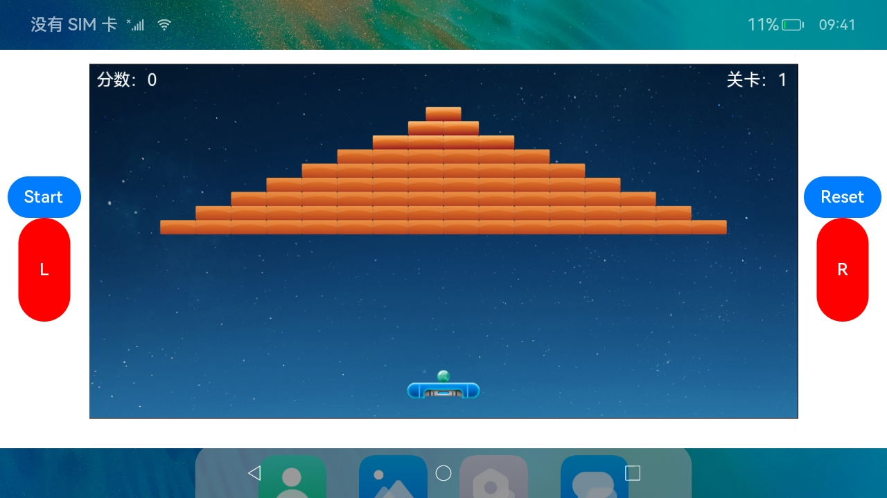

# JS注入与执行

### 简介

本示例基于H5游戏，通过arkui的button实现对游戏实现基本控制，展示webview的JS注入与执行能力，及native应用与H5的通信能力。

> 本例的H5游戏页面，由https://yangyunhe369.github.io/h5-game-blockBreaker/ 提供

### 相关概念

NA

### 相关权限

网络访问权限: ohos.permission.INTERNET

### 使用说明

1.设备连接热点，可访问互联网。

2.打开应用，通过界面中按钮进行游戏控制。

### 约束与限制

1.本示例仅支持标准系统上运行。

2.本示例仅支持API9版本SDK，版本号：3.2.10.6。

3.本示例需要使用DevEco Studio 3.1 Canary1 (Build Version: 3.1.0.100, built on November 3, 2022)才可编译运行。