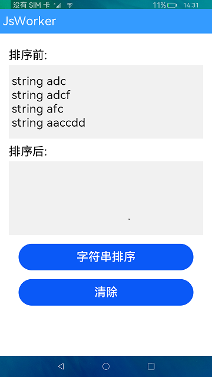

# 启动一个worker

### 简介

本示例展示了如何启动一个worker线程，并实现worker线程和宿主线程的通信。实现效果如下：

### 相关概念

Worker：Worker是与主线程并行的独立线程。创建Worker的线程称之为宿主线程，Worker自身的线程称之为Worker线程。创建Worker传入的url文件在Worker线程中执行，可以处理耗时操作但不可以直接操作UI。

### 相关权限

不涉及。

### 使用说明

1.在首页中显示了排序前的四个字符串，点击**字符串排序**按钮，会将排序前的字符串发送给worker线程，在worker线程实现字符串排序，然后将排序后的字符串发送给主线程，主线程中显示排序后的字符串。

2.点击**清除**按钮，清除排序后的字符串。

### 约束与限制

1.本示例仅支持标准系统上运行。

2.本示例需要使用DevEco Studio 3.0 Beta4 (Build Version: 3.0.0.992, built on July 14, 2022)才可编译运行。