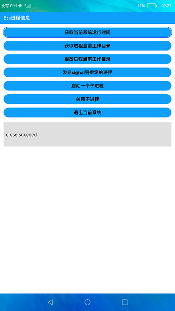

# 进程信息

### 介绍

本示例使用[process](https://gitee.com/openharmony/docs/blob/master/zh-cn/application-dev/reference/apis/js-apis-process.md)所提供获取进程相关信息的api接口，展示了在eTS中如何获取进程信息和启动一个子进程运行一段shell。

使用说明：

首页中展示了各个功能按钮，包括当前系统运行时间、获取进程当前工作目录、更改进程当前工作目录、发送signal到指定的进程、启动一个子进程、关闭子进程、退出当前系统的功能，点击相应的按钮完成该功能代码运行。

### 效果预览

|主页|
|--------------------------------|
||

### 相关权限

不涉及。

### 依赖

不涉及。

### 约束与限制

1.本示例支持标准系统上运行。

2.本示例仅支持API9版本SDK，版本号：3.2.7.6。

3.本示例需要使用DevEco Studio 3.1 Canary1 (Build Version: 3.1.0.100, built on November 3, 2022)才可编译运行。

4.本示例需要使用@ohos.process系统权限的系统接口。使用Full SDK时需要手动从镜像站点获取，并在DevEco Studio中替换，具体操作可参考[替换指南](https://docs.openharmony.cn/pages/v3.2/zh-cn/application-dev/quick-start/full-sdk-switch-guide.md/)。
