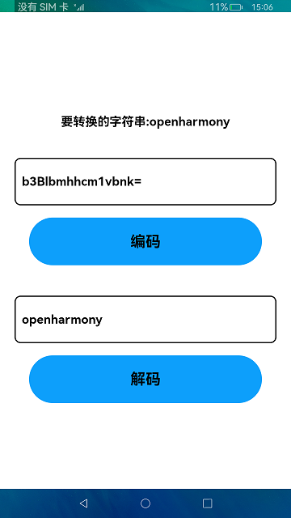

# Base64编解码

### 介绍

Base64是一种基于64个可打印字符来表示二进制数据的方法，本示例展示了Base64编码及解码的结果输出。

使用说明：
1. 点击**编码**按钮，将会把字符串转换为ASCII码，然后对ASCII码进行编码，并在文本框输出编码后的结果。
2. 点击**解码**按钮，将会把编码后输出的结果作为解码器的入参，解码后得到ASCII码数组，然后将ASCII码数组转换为字符串在文本框输出。

### 效果预览

|首页|
|--------|
||

### 相关权限

不涉及。

### 依赖

不涉及。

### 约束与限制

1.本示例仅支持在标准系统上运行;

2.本示例仅支持API9版本SDK，版本号：3.2.9.2;

3.本示例需要使用DevEco Studio 3.1 Canary1 (Build Version: 3.1.0.100, built on November 3, 2022)才可编译运行。