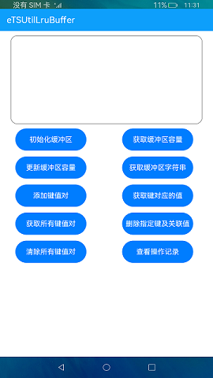

# 缓冲区

### 介绍

本示例展示了在eTS中缓冲区的初始化和api接口的使用。
1.在首页中分为两个区域，文本显示框和按钮区域，点击**初始化缓冲区**、**获取缓冲区容量**、**更新缓冲区容量**、**获取缓冲区字符串**、**添加键值对**、**获取键对应的值**、**获取所有键值对**、**删除指定键及其关联值**、**清除所有键值对**、**查看操作记录**按钮可以分别执行对应的操作并在文本显示框中显示操作的结果。

### 效果预览

### 相关权限

不涉及。

### 依赖

不涉及。

### 约束与限制

1.本示例仅支持标准系统上运行。

2.本示例仅支持API9版本SDK，版本号：3.2.9.2。

3.本示例需要使用DevEco Studio 3.1 Canary1 (Build Version: 3.1.0.100, built on November 3, 2022)才可编译运行。
