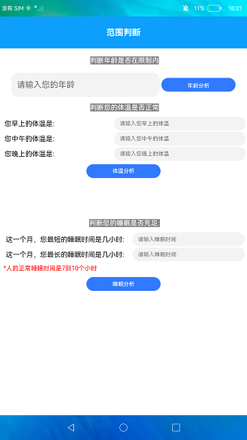

# 范围判断

### 介绍

本示例主要展示数据的范围判断的功能，通过使用[@ohos.util](https://gitee.com/openharmony/docs/blob/master/zh-cn/application-dev/reference/apis/js-apis-util.md)提供的范围判断功能去判断某一个数值是否在给定范围内。

使用说明：

1.在文本框中输入年龄，点击**年龄分析**按钮，判断您的年龄是否符合工作年龄限制(18-62岁)，并弹窗提示。

2.在文本框输入一天的体温情况，点击**体温分析**按钮，会根据体温的最大值和最小值判断体温是否在正常范围，同时会有弹窗提示。

3.在文本框输入一个月睡眠最长和最短时间，点击**睡眠分析**按钮，会根据输入的睡眠时长计算与正常睡眠时长的并集和交集，并弹窗提示。

### 效果预览

### 相关权限

不涉及。

### 相关依赖

不涉及。

### 约束与限制

1.本示例仅支持在标准系统上运行。

2.本示例仅支持API9版本SDK，版本号：3.2.9.2。

3.本示例需要使用DevEco Studio 3.1 Canary1 (Build Version：3.1.0.101， built on November 29， 2022)才可编译运行。