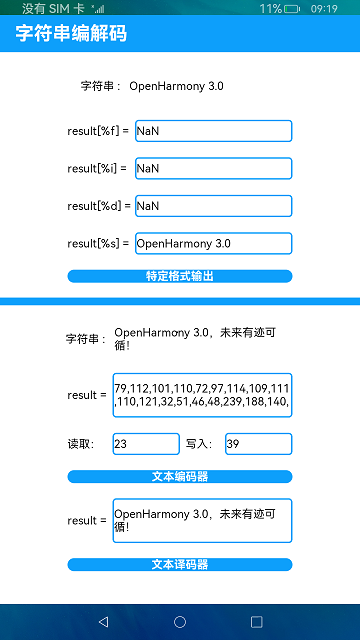

# 字符串编解码

### 介绍

本示例主要展示对字符串的特定格式的输出功能以及其编解码功能，通过使用[@ohos.util](https://gitee.com/openharmony/docs/blob/master/zh-cn/application-dev/reference/apis/js-apis-util.md)接口提供的format和字符串编解码（TextEncoder，TextDecoder）功能，去实现对字符串特定格式的输出以及编码和解码的文本输出。

特定格式输出：可以对字符串进行特定格式的输出。

文本编解码：可以对字符串进行编码和解码的操作。

### 效果预览

使用说明：

1.点击**特定格式输出**，文本框会对该字符串进行不同格式的结果输出，例如整数、浮点数、字符串等格式；

2.点击**文本编码器**，会对上面字符串编码，输出编码后的文本，并输出编码返回的读取与写入的信息；

3.点击**文本译码器**，会对第二步编码后的文本内容进行译码，输出译码后的文本。

### 相关权限

不涉及。

### 相关依赖

不涉及。

### 约束与限制

1.本示例仅支持在标准系统上运行；

2.本示例仅支持API9版本SDK，版本号：3.2.9.2；

3.本示例需要使用DevEco Studio 3.1 Canary1 (Build Version：3.1.0.101， built on November 29， 2022)才可编译运行。