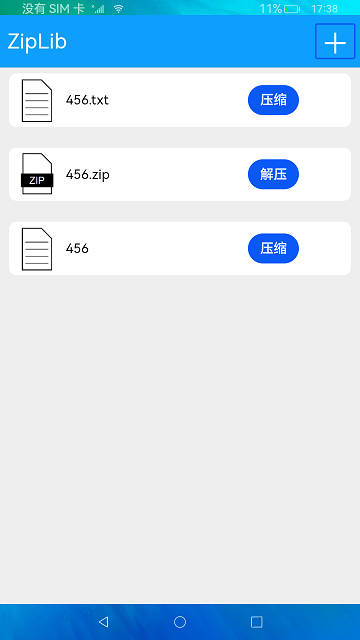

# Zip and Unzip

### Introduction

This sample demonstrates the use of @ohos.zlib. Below shows the sample app.

### Concepts

Zip: compresses a file or folder based on the passed file path to zip and the path of the zipped file.

Unzip: decompresses a file or folder based on the passed file path to unzip and the path of the unzipped file.

### Required Permissions

N/A

### Usage

1. Touch **+** in the upper right corner of the sample app.

2. In the **Create file** dialog box displayed, enter the file name and content, and touch **OK**.

3. The file created is displayed on the home page. Touch **Zip**. A message is displayed, indicating that the file is compressed, and a **.zip** file with the same name is created in the file list.

4. Touch **Unzip** next to the zipped file. A message is displayed, indicating that the file is decompressed, and a folder with the same name is created in the file list.

### Constraints

1. This sample can only be run on standard-system devices.

2. This sample requires DevEco Studio 3.1 Canary1 (Build Version: 3.1.0.100, built on November 3, 2022) to compile and run.

3. The paths passed in the `Zip` and `Unzip` APIs must be the relative paths obtained by the context API. Currently, `Zip` and `Unzip` support operations only on files in the app directory.
