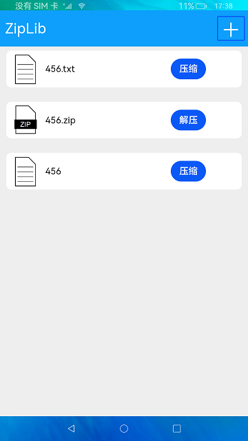

# 压缩与解压

### 介绍

本示例通过@ohos.zlib接口，实现解压，压缩文件场景。

使用说明

1.点击屏幕右上角 **+** 按钮，弹出创建文件窗口。

2.输入文件名称、文件内容，并点击 **确定** 按钮来创建文件。

3.文件创建成功后，文件名称自动追加.txt后缀并在主页面列表会显示，同时文件的物理地址为/data/app/el2/100/base/ohos.samples.ziplib/haps/entry/files/，点击 **压缩** 按钮，提示“文件压缩成功”，并会在文件列表创建一个相同名称的.zip文件。

4.点击压缩文件后的 **解压** 按钮，提示“文件解压成功”，并会再次在文件列表创建一个同名文件夹。

### 效果预览

### 相关权限

不涉及。

### 依赖

不涉及。

### 约束与限制

1.本示例仅支持在标准系统上运行。

2.本示例需要使用DevEco Studio 3.1 Canary1 (Build Version: 3.1.0.100, built on November 3, 2022)才可编译运行。

3.解压与压缩相关接口的入参路径必须为context相关接口获取的相对路径，目前该接口仅支持操作应用目录下的文件。

4.本示例仅支持API9版本SDK，版本号：3.2.9.2。