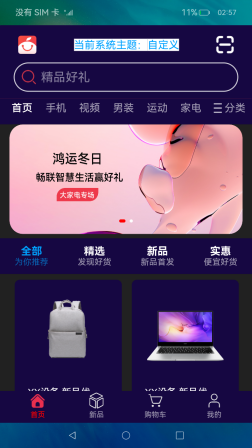

# 应用主题切换

## 介绍

本示例展示多种应用主题切换。

本示例通过创建 base 同级资源文件夹 dark 和 light 完成深色浅色主题相关资源配置，实现深色浅色主题切换，在 ThemeConst 文件中配置自定义主题文件，通过控制变量实现多主题切换。

使用说明：

1. 点击头部切换主题按钮，选择想要切换的主题。
2. 系统深浅模式切换，应用主题自动跟随切换深浅模式。

## 效果预览

## 相关权限

允许更新系统配置：[ohos.permission.UPDATE_CONFIGURATION](https://gitee.com/openharmony/docs/blob/master/zh-cn/application-dev/security/permission-list.md)

## 约束与限制

1. 本示例仅支持标准系统上运行，支持设备：RK3568。
2. 本示例支持 API9 版本 SDK，本示例涉及使用系统接口：@ohos.application.abilityManager，需要手动替换 Full SDK 才能编译通过，具体操作可以参考[替换指南](https://docs.openharmony.cn/pages/v3.2/zh-cn/application-dev/quick-start/full-sdk-switch-guide.md/) 。
3. 本示例需要使用 DevEco Studio 3.0 Beta4 (Build Version: 3.0.0.993, built on July 14, 2022)才可编译运行。
4. 本示例所配置的权限 ohos.permission.UPDATE_CONFIGURATION 为 system_basic 级别(相关权限级别可通过[权限定义列表](https://gitee.com/openharmony/docs/blob/master/zh-cn/application-dev/security/permission-list.md) 查看),需要手动配置对应级别的权限签名(具体操作可查看[自动化签名方案](https://docs.openharmony.cn/pages/v3.2/zh-cn/application-dev/security/hapsigntool-overview.md/))
