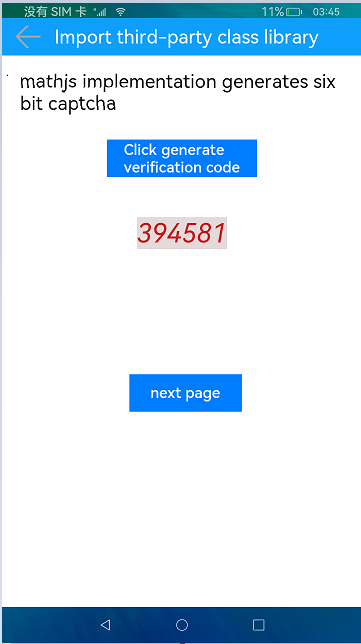

# Usage of npm

### Introduction

This sample shows how npm references third-party JS class libraries (mathjs and dayjs) and local libraries. The display effect is as follows:

### Concepts

npm: a package manager that references third-party JS class libraries and local libraries.

##### Importing a Third-Party JS Class Library

1. Open the **Terminal** window and run the following command to go to the **entry** directory:

    cd entry

2. Run the following command to install a third-party library package. In this example, **dayjs** is being installed.

    npm install dayjs --save

3. Import the third-party library package in the corresponding .ets file.

    import dayjs from 'dayjs'

##### Creating a Local Library

1. Right-click the project name, choose **New > Module**, click **Ohos Library** on the **Choose Your Ability Template** page displayed, enter the module name, and click **Finish**.

2. In the new module directory, edit the **name** attribute in the **Package.json** file, for example, **name:@ohos/library**.

3. In the **entry** directory, add the new module as a dependency to the **dependencies** attribute in the **Package.json** file, for example, **"@ohos/library": "../library"**.

4. In the new **Module** directory, add the common components or interfaces to be exported to **Index.ets** file.

5. In the **entry** directory, import the common component or interface in the new module to be used, for example, **import {ThirdTitleBar} from '@ohos/library'**.

### Required Permissions

N/A

### Usage

1. The home page of the sample app shows the application of mathjs. After you touch **Click generate verification code**, a six-digit random verification code is generated in the lower part. If you touch the button again, a new verification code is displayed. You can touch **Back** to exit the app.

2. Touch **Next page**, and the application of dayjs is displayed. Enter the date to be calculated, enter either the number of days backwards or forwards, or both of them, and touch **Confirm**. The calculation result is displayed in the lower part. You can touch **Back** to return to the mathjs application page.

3. Touch **Next page**, and the application of the local library is displayed. Enter two strings as prompted and touch **Confirm**. The string after concatenation is displayed in the lower part. You can touch **Back** to return to the dayjs application page.

### Constraints

1. This sample can only be run on standard-system devices.

2. In this sample, only open-source pure logic third-party libraries can be imported. The **format** method in dayjs is not supported.

3. This sample is based on the stage model, which is supported from API version 9.

4. DevEco Studio 3.0 Beta4 (Build version: 3.0.0.992, built on July 14, 2022) must be used.
