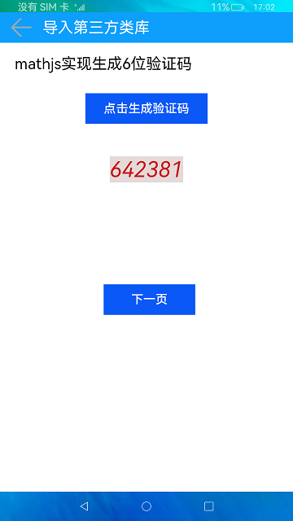

# npm的使用

### 简介

本示例展示了npm引用第三方js类库和本地库，主要展示了mathjs、dayjs和本地库应用。实现效果如下：

### 相关概念

npm：npm引用第三方js类库和本地库。

##### 第三方js类库导入步骤

1.打开Terminal窗口，通过如下指令进入到entry目录。

    cd entry

2.以引入“dayjs”为例，执行以下指令进行安装。

    npm install dayjs --save

3.命令执行完成后在需要应用dayjs库的ets文件中引入该库。

    import dayjs from 'dayjs'

##### 本地库新建步骤

1.右键点击工程名，选择New，选择Module，选择Ohos library方式创建，修改Module的名称，点击finish。

2.在新建的Module目录下，编辑Package.json中的“name”属性，比如：“name”：“@ohos/library”。

3.在entry目录下，编辑Package.json中的“dependencies”属性，新增新建的Module作为依赖，比如："@ohos/library": "../library"。

4.在新建的Module目录下，编辑Index.ets，将需要export的公共组件或者接口添加进去。

5.在entry目录下，在需要用到新建Module里面公共组件或者接口时，import该组件进而应用，比如：import {ThirdTitleBar} from '@ohos/library'。

### 相关权限

不涉及。

### 使用说明

1.首页是对mathjs的应用，点击**点击生成验证码**，下方会生成六位随机验证码，点击一次，验证码会刷新一次，点击**返回**，退出该程序。

2.点击**下一页**按钮，页面跳转到第二页对dayjs的应用，按照提示条件必需输入要计算的日期，至少填写一个向前或者向后推多少天，点击**确认**按钮，下方会显示出计算的结果，点击**返回**按钮，返回到第一页对mathjs的应用。

3.点击**下一页**按钮，页面跳转到第三页对本地库的应用，按照提示必须输入两个字符串，点击**确定**，下方会显示两个字符串拼接后的字符串。点击**返回**按钮，返回第二页对dayjs的应用。

### 约束与限制

1.本示例仅支持在标准系统上运行。

2.本示例仅支持已经开源纯逻辑第三方库的导入。

3.本示例为Stage模型，从API version 9开始支持。

4.本示例需要使用DevEco Studio 3.0 Beta4 (Build Version: 3.0.0.992, built on July 14, 2022)才可编译运行。
