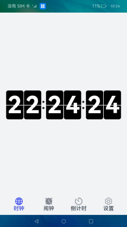

# Flip Clock

### Introduction

 This sample uses the Feature Ability (FA) model and related APIs to implement a simple flip clock app. Below shows the sample app.

  

### Concepts

**reminderAgent**: a class that provides APIs to create scheduled reminders for countdown timers, calendar events, and alarm clocks. When the created reminders are published, the timing and pop-up notification functions of your application will be taken over by the reminder agent in the background when your application is frozen or exits.

### Required Permissions

ohos.permission.PUBLISH_AGENT_REMINDER (permission for the reminder agent)

ohos.permission.RUNNING_LOCK (permission for the running lock)

ohos.permission.NOTIFICATION_CONTROLLER (permission for send notification)

### Usage

1. There are four tab bars (**Clock**, **Alarm**, **Countdown**, and **Settings**) at the bottom of the home page of the sample app. The **Clock** tab page displays a flip clock.

2. On the **Alarm** tab page, you can touch **+** to create an alarm record. When the alarm time arrives, a notification will be displayed.

3. The **Countdown** tab page provides the countdown function.

4. The **Settings** tab page provides the following functions: full screen, screen brightness adjustment, and screen-on.

### Constraints

1. This sample can only be run on standard-system devices.

2. This sample requires DevEco Studio 3.1 Canary1 (Build Version: 3.1.0.100, built on November 3, 2022) to compile and run.